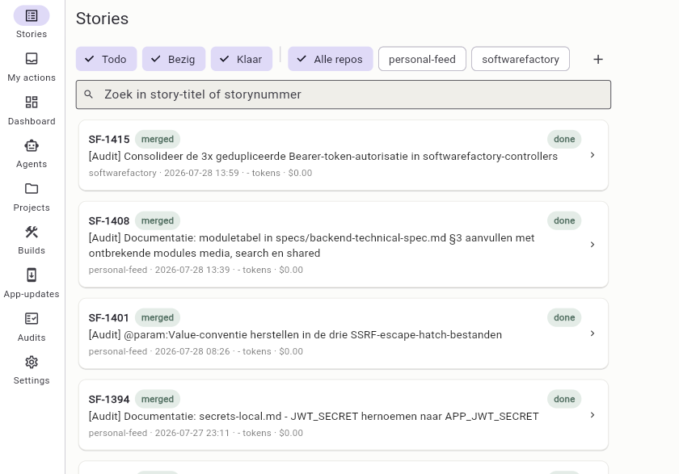
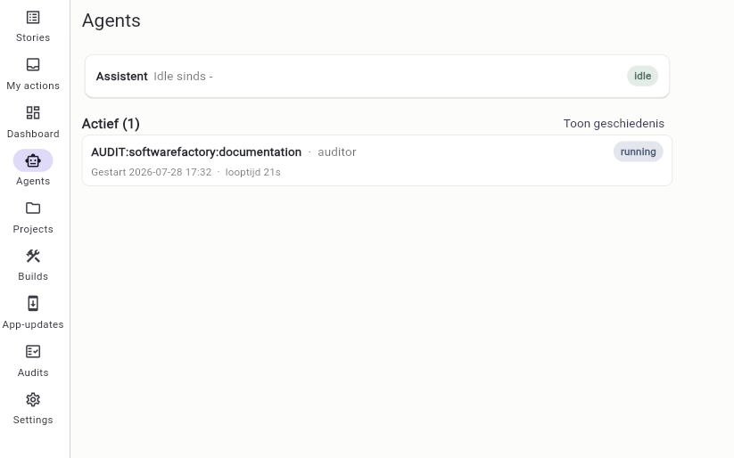
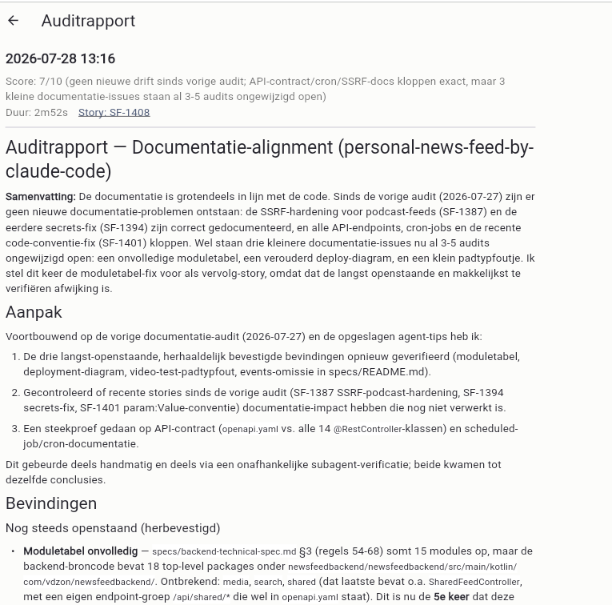
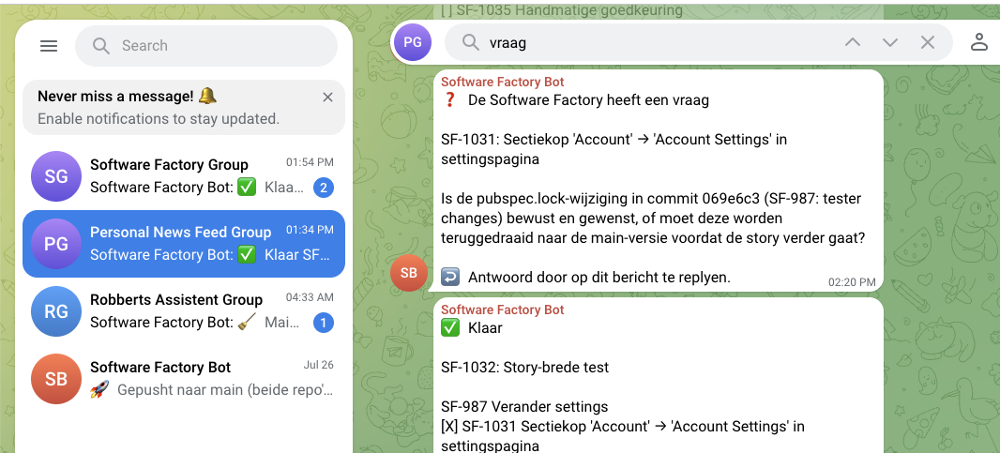
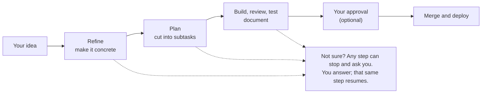
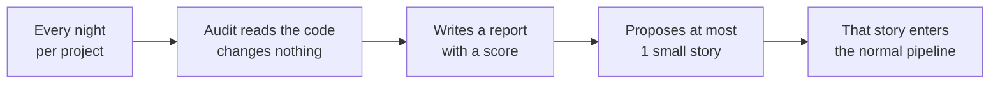

# Software Factory

**A software factory that builds software. You describe what you want; AI agents refine it, plan
it, build it, review it, test it, document it, merge it and deploy it — and they ask you whenever
they're unsure.**

Software Factory is a self-built platform that runs a full development pipeline on autopilot. It
is not a chatbot you copy-paste code out of: it is a factory floor. Work arrives as a story, moves
through a chain of specialised agents, and comes out the other end as a merged pull request on a
running system. A human stays in charge — but only where a human adds something.

It has been running since 23 May 2026 and has, at the time of writing, merged **141 stories** into
real, live applications.

---

## What it does

### From an idea to merged code, without you opening a pull request

You write down what you want — in the dashboard, or just by telling the Telegram assistant. From
there the factory takes over:

1. A **refiner** sharpens the idea into a proper story: scope, acceptance criteria, assumptions.
2. A **planner** decides the approach and cuts the work into subtasks.
3. A **developer** writes the code *and* the tests, on its own branch.
4. A **reviewer** reads the whole change, hunting for bugs and missing coverage.
5. A **tester** verifies the behaviour — the factory itself re-runs the full test suite afterwards,
   because "the agent said it was green" is not evidence.
6. A **summarizer** and **documenter** write the story summary and update the documentation.
7. The factory merges the pull request and deploys it.

Per project, you decide how much of that you trust: fully automatic, or with an approval gate
right before the merge.

### When the AI isn't sure, it asks instead of guessing

This is the part that makes it usable. An agent that hits an ambiguity does not invent an answer
and quietly build the wrong thing. It stops, parks the story, and asks you a question — in the
dashboard and in Telegram. You answer in one sentence, and the agent picks up exactly where it
left off.

### Every night it audits itself and creates its own follow-up work

Besides the work you ask for, a read-only **audit** runs each night per project: code quality,
security, ADR compliance, consistency, documentation, test coverage. An audit never changes
anything. It writes a report, and if it finds something structural, it proposes at most one small
follow-up story to fix it — which then goes through the normal pipeline above.

That loop is real, not theoretical. A documentation audit found that `docs/factory/secrets-local.md`
told developers to set `JWT_SECRET` while the code actually reads `APP_JWT_SECRET` — a mismatch
that silently invalidates everyone's login tokens on restart. It filed story SF-1394. The factory
refined it, fixed it, reviewed it, tested it and merged it. Nobody typed a line of that.

### Everything in one place

One dashboard for the whole factory: which agents are running right now and for how long, build
and deploy status per project and branch, all stories with their state, and every audit report
with its score history. No separate browser tab per repository.

### A factory assistant in your pocket

Telegram is a full channel, not just notifications. Ask for a story's status, create a new story,
steer a running one, answer an agent's question — a real assistant with memory, not a fixed
command list.

---

## What it looks like

**Work the factory finished by itself.** Every one of these started as a nightly audit finding,
became a story, and was built, reviewed, tested and merged without anyone writing the code.

**An audit run in progress.** The factory shows what is working right now and for how long.

**What an audit produces.** A score with a one-line justification, then a readable report: what was
examined, what was found, and what it proposes to do about it.

**It asks rather than guesses.** An agent that hits an ambiguity stops and asks — here in Telegram,
where answering is a matter of replying to the message.

<!-- SCREENSHOT: docs/images/dashboard-audits.png — the Audits screen, both projects visible,
     showing each audit type with its last run time and the story it produced. Still missing;
     see docs/images/README.md. -->

---

## How it works

The everyday version — an idea goes in on the left, working software comes out on the right, and
the only time it stops is to ask you something:

```mermaid
flowchart LR
    IDEA["Your idea"] --> REFINE["Refine<br/>make it concrete"]
    REFINE --> PLAN["Plan<br/>cut into subtasks"]
    PLAN --> BUILD["Build, review, test<br/>document"]
    BUILD --> APPROVE["Your approval<br/>(optional)"]
    APPROVE --> SHIP["Merge and deploy"]
    ASK["Not sure? Any step can stop and ask you.<br/>You answer; that same step resumes."]
    REFINE -.-> ASK
    PLAN -.-> ASK
    BUILD -.-> ASK
```

And the night shift, which generates work rather than consuming it:

```mermaid
flowchart LR
    NIGHT["Every night<br/>per project"] --> AUDIT["Audit reads the code<br/>changes nothing"]
    AUDIT --> REPORT["Writes a report<br/>with a score"]
    REPORT --> STORY["Proposes at most<br/>1 small story"]
    STORY --> PIPE["That story enters<br/>the normal pipeline"]
```

Every agent runs isolated in its own Docker container, with only the repository it is working on
mounted. Agents never commit or push themselves and never touch a pull request — the factory does
that, after the run, once the evidence checks out.

The full phase model behind this (`Story Phase` and `Subtask Phase`, with every state and
transition) is documented in [docs/technical/overview.md](docs/technical/overview.md).

---

## By the numbers

Measured on the live instance, 28 July 2026 — roughly two months after the first agent run:

| | |
|---|---|
| Stories created | 182 |
| Subtasks executed | 885 |
| Agent runs | 1,474 |
| Stories merged | 141 |
| Automatic deploys | 96 |
| Agent runtime | ~55 hours |
| Agent roles | 8 (refiner, planner, developer, reviewer, tester, summarizer, documenter, auditor) |

---

## Is it any good?

Honest answer: it depends on the work. The factory is strong at well-bounded changes — a bug with
a clear reproduction, a refactor with a clear target, documentation drift, a small feature on an
existing pattern. That is exactly the kind of work the nightly audits generate, which is why the
loop feeds itself.

It is weaker at open-ended design work, and it costs real money in AI tokens. It also needs the
guardrails it has: the factory re-runs the full test suite itself after every developer and tester
run, because an agent claiming "all tests pass" is not evidence. A red test suite sends the story
straight back to development, with no exception for "pre-existing" failures.

---

## Want to run it yourself?

Everything you need — requirements, secrets, linking projects to repositories, Docker services,
building the agent images and starting the factory — is in
**[docs/installation.md](docs/installation.md)**.

## For developers

Read in this order, depending on what you're after:

1. [docs/installation.md](docs/installation.md) — install and run it yourself.
2. [runbook.md](runbook.md) — operations: what runs where, config/secrets, troubleshooting.
3. [docs/factory/functional-spec.md](docs/factory/functional-spec.md) — **what** the factory does.
4. [docs/factory/technical-spec.md](docs/factory/technical-spec.md) — **how** it's built.
5. [docs/onboarding-senior-developer.md](docs/onboarding-senior-developer.md) — the mental model,
   the main flow, the reasoning behind the architecture, test strategy, cookbooks and a review
   checklist.
6. [docs/kwaliteitsanalyse.md](docs/kwaliteitsanalyse.md) — the quality analysis and the July 2026
   refactor.

In addition: [docs/technical/](docs/technical/) (generated technical reference, including the full
phase model) and [specs/specs.md](specs/specs.md) (historical archive).
