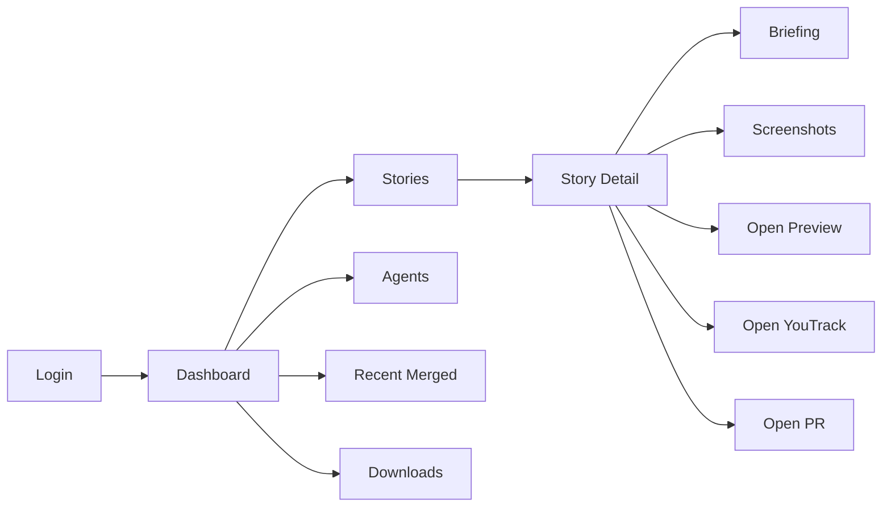

# Screen Map

## Navigation

The app uses a persistent left sidebar on authenticated screens.

Primary nav:

- `Dashboard`
- `Repositories`
- `Stories`
- `Agents`
- `Builds`
- `Recent merged`
- `Downloads`
- `Settings`

For the Flutter/OpenShift dashboard redesign, prefer the repository-centric
navigation in [dashboard-v2.md](dashboard-v2.md). In that design, `Recent
merged` is not a primary nav item; it becomes repository/story context.

Use `Agents`, not `Claude`, because `AI-supplier` can be `mock`, `claude`,
`openai`, `copilot` or `microsoft`.

## Routes

| Route | Screen | Purpose |
|---|---|---|
| `/login` | Login | Authenticate into the dashboard. |
| `/` or `/dashboard` | Dashboard | Operational overview and recent activity. |
| `/stories` | Stories | All YouTrack issues currently owned by AI. |
| `/stories/{issueKey}` | Story Detail | Full status, commands, deploy, budget and run data. |
| `/stories/{issueKey}/briefing` | Briefing | Agent comments/results in chronological order. |
| `/stories/{issueKey}/screenshots` | Screenshots | Tester screenshot gallery. |
| `/agents` | Agents | Active factory agents and interactive sessions. |
| `/merged` | Recent Merged | Recently merged PRs and usage totals. |
| `/downloads` | Downloads | APK/artifact downloads. |
| `/nightly` | Nightly | Status of the current/last automatic nightly run (per project) plus the manual job list and Nightly button. |
| `/settings` | Settings | User/session settings, the writable nightly-scheduler form, and logout. |

## Common Layout

Authenticated screens share:

- Sidebar with product mark and active nav item.
- Page header with title, subtitle and optional refresh/action controls.
- Content width uses the available viewport; rows remain dense on desktop.
- Mobile collapses sidebar into a top bar and keeps tables horizontally scrollable
  only where necessary.

## Core Flow

## Status Language

User-facing status should be specific:

- `queued`
- `refining`
- `developing`
- `reviewing`
- `testing`
- `summarizing`
- `waiting for user`
- `paused`
- `stuck`
- `tested ok`
- `summary finished`
- `merged`

Avoid using only generic `AI in progress` when a more precise phase is known.

## Shared States

Every data-driven screen needs:

- Loading state: skeleton rows or subdued `Laden...` text.
- Empty state: compact explanation and next useful action.
- Error state: readable message, retry button, and no stack traces.
- Refresh state: manual refresh button plus timestamp where useful.
