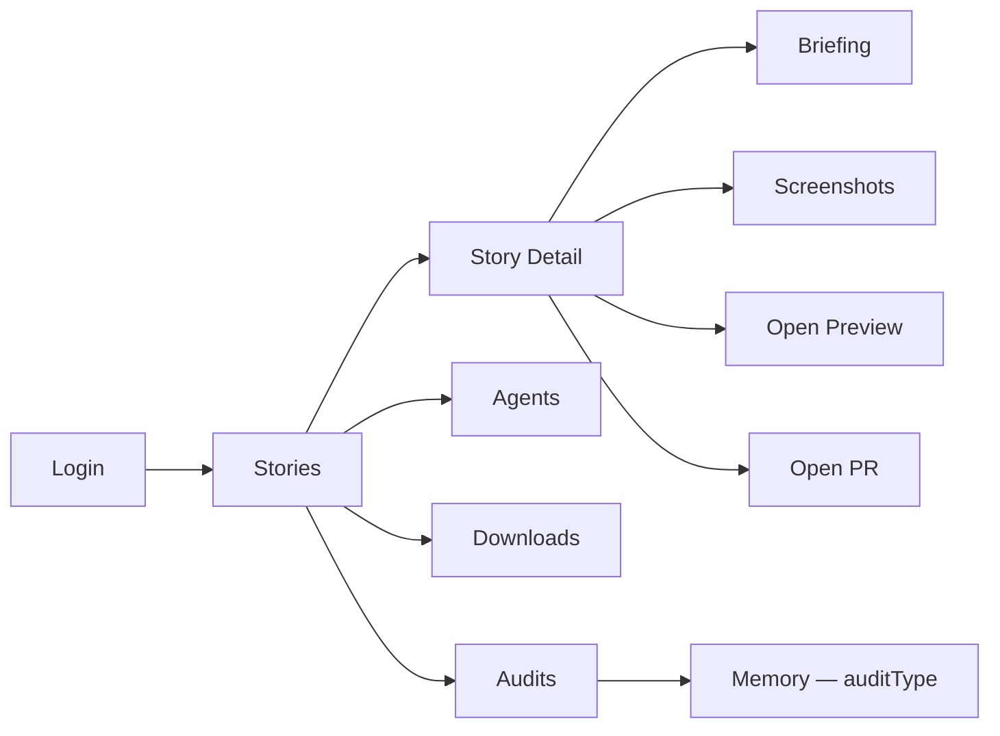

# Screen Map

## Navigation

The app uses a persistent left sidebar on authenticated screens.

Primary nav:

- `Repositories`
- `Stories`
- `Agents`
- `Builds`
- `Downloads`
- `Settings`

For the Flutter/OpenShift dashboard redesign, prefer the repository-centric
navigation in [dashboard-v2.md](dashboard-v2.md).

The `Recent Merged` screen and nav item were removed (SF-1288); merged-story
history is not currently exposed as a dedicated screen.

The `Dashboard` overview screen and nav item were removed (SF-1676): the screen
was never used and has no replacement or redirect. In `dashboard-frontend` the
primary bottom nav is now `Stories`, `My actions`, `Agents` plus `Meer`
(`Projects`, `Builds`, `App-updates`, `Audits`, `Opruimen`, `Settings`). The backend chain
behind it (`/api/v1/dashboard`, bridge-operatie `dashboard.get`) stays in place
for already deployed APK versions; see [screens/dashboard.md](screens/dashboard.md).

Use `Agents`, not `Claude`, because `AI-supplier` can be `mock`, `claude`,
`openai`, `copilot` or `microsoft`.

## Routes

| Route | Screen | Purpose |
|---|---|---|
| `/login` | Login | Authenticate into the dashboard. |
| `/stories` | Stories | All tracker issues currently owned by AI. |
| `/stories/{issueKey}` | Story Detail | Full status, commands, deploy, budget and run data. |
| `/stories/{issueKey}/briefing` | Briefing | Agent comments/results in chronological order. |
| `/stories/{issueKey}/screenshots` | Screenshots | Tester screenshot gallery. |
| `/agents` | Agents | Active factory agents and interactive sessions. |
| `/builds` | Builds | GitHub Actions workflow status per managed repository (SF-876). |
| `/projects` | Projects | Per-project story counters, cost, production version and build/deploy status (SF-890). |
| `/downloads` | Downloads | APK/artifact downloads. |
| `/audits` | Audits | Per-project audit reports, score trend and a "run now" button (`AuditScreen`, replaces the former `/nightly` screen). "Open memory" pushes a full-page `AuditMemoryScreen` (SF-1676) instead of a dialog: own `AppBar` with title `Memory — <auditType>`, the standard back button, `+` as `AppBar` action, content left-aligned in a `ConstrainedBox(maxWidth: 860)`. It is a `Navigator.push(MaterialPageRoute(...))` without its own route name or deeplink; editing and deleting a tip stay small `AlertDialog`s. |
| `/maintenance` | Opruimen | History of *all* cleanup rounds the factory runs (`MaintenanceScreen`, SF-1913, generalised in SF-1921): one tile per round with timestamp, a `kind` badge (`github-releases`, `agent-events`, `agent-runs`, `completion-payloads`, `workspaces`), the project (omitted for factory-wide rounds), "N opgeruimd / M bewaard" and a `dry-run`/`fout` badge where applicable. A `Soort:` dropdown filters on kind and defaults to `alle soorten`; the choice is passed on as the `kind` query parameter and reloads the list. The nightly GitHub cleanup also logs rounds without deletions — that is the proof the cleaner ran; the four factory-wide cleaners only log deletions and failures. Tapping a round pushes a full-page detail screen (own `Scaffold`/`AppBar` titled `Opruimronde`, content in a `ConstrainedBox(maxWidth: 860)`) with the kept/deleted counts and the error message, plus — for `github-releases` only — the release/package breakdown and the deleted release tags and package versions. Since SF-1928 a `Panel` above the filter holds a `Wrap` of `TextButton`s (same look-and-feel as the audit actions, stacking below 560px): one per kind plus `Alles draaien` (`kind=all`), posting to `POST /api/v1/maintenance/run`. Feedback goes through `showActionResult` per status (`started`/`already_running`/`disabled`/`unknown_kind`); a button is disabled while a request is in flight and while `runningKinds` from `maintenance.cleanupsList` reports that kind as running. After a start the list reloads through a `GlobalKey<DataScreenState>` and keeps polling every 3s until nothing runs any more; manually started rounds carry an extra `handmatig` badge in both the list and the detail. No paging; `Navigator.push(MaterialPageRoute(...))` without its own route name or deeplink. |
| `/settings` | Settings | User/session settings and the per-project audit-scheduler settings. |

## Common Layout

Authenticated screens share:

- Sidebar with product mark and active nav item.
- Page header with title, subtitle and optional refresh/action controls.
- Content width uses the available viewport; rows remain dense on desktop.
- Mobile collapses sidebar into a top bar and keeps tables horizontally scrollable
  only where necessary.

## Core Flow

```mermaid
flowchart LR
    Login["Login"] --> Stories["Stories"]
    Stories --> Detail["Story Detail"]
    Detail --> Briefing["Briefing"]
    Detail --> Screenshots["Screenshots"]
    Detail --> Preview["Open Preview"]
    Detail --> PullRequest["Open PR"]
    Stories --> Agents["Agents"]
    Stories --> Downloads["Downloads"]
    Stories --> Audits["Audits"]
    Audits --> Memory["Memory — auditType"]
```

## Status Language

User-facing status should be specific:

- `queued`
- `refining`
- `developing`
- `reviewing`
- `testing`
- `summarizing`
- `waiting for user`
- `paused`
- `stuck`
- `tested ok`
- `summary finished`
- `merged`

Avoid using only generic `AI in progress` when a more precise phase is known.

## Shared States

Every data-driven screen needs:

- Loading state: skeleton rows or subdued `Laden...` text.
- Empty state: compact explanation and next useful action.
- Error state: readable message, retry button, and no stack traces.
- Refresh state: manual refresh button plus timestamp where useful.
