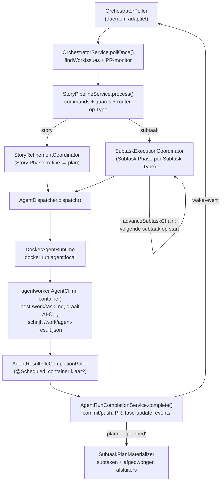

# Onboarding — senior software developer

Welkom. Dit document is bedoeld om je zelfstandig te maken op deze codebase: na het lezen moet
je code kunnen aanpassen én reviews kunnen doen. Het legt daarom vooral het **waarom** van de
ontwerpkeuzes vast; het "wat" staat elders en herhalen we hier niet:

- [../runbook.md](../runbook.md) — operatie: waar draait wat, config & secrets, troubleshooting.
- [factory/functional-spec.md](factory/functional-spec.md) — wat de factory functioneel doet.
- [factory/technical-spec.md](factory/technical-spec.md) — stack, modules, configuratie.
- [factory/development.md](factory/development.md) — build/test-commando's en lokale setup.
- [technical/](technical/README.md) — gegenereerde naslag (modules, endpoints, scheduled jobs, externe systemen).
- [kwaliteitsanalyse.md](kwaliteitsanalyse.md) — de kwaliteitsanalyse en de refactor van juli 2026 (fase 1–5); veel keuzes hieronder zijn dáár gemotiveerd en uitgevoerd.

Klassen-verwijzingen hieronder zijn — tenzij anders vermeld — relatief aan
`softwarefactory/src/main/kotlin/nl/vdzon/softwarefactory/`.

---

## 1. Het mentale model (lees dit eerst)

Drie zinnen die de hele architectuur dragen:

1. **YouTrack is de bron van waarheid voor proces-state.** De fase-velden op issues
   (`Story Phase`, `Subtask Phase`, plus `Subtask Type`, `Error`, `Paused`, …) zíjn de
   state-machine. De factory leest die velden, beslist, en schrijft nieuwe fasen terug.
   Er is geen proces-state in geheugen of in de eigen database die YouTrack tegenspreekt.
2. **De Postgres-database is boekhouding.** `story_runs`, `agent_runs`, `agent_events`,
   kosten/usage, Telegram-state en de nightly-tabellen registreren *wat er gebeurd is* —
   niet *waar het proces staat*. (Eén nuance: caps zoals de developer-loopback- en
   test-reset-teller tellen op `agent_runs` per story-run, dus die boekhouding heeft wél
   procesgevolgen. Zie §3 en de waarschuwing in `SubtaskExecutionCoordinator.handleTestRejection`.)
3. **De poller is de motor.** `orchestrator/schedulers/OrchestratorPoller.kt` draait als
   daemon-thread en roept elke cyclus `OrchestratorService.pollOnce()` aan. Elke poll kijkt
   opnieuw naar de YouTrack-velden en doet wat daar uit volgt.

Waarom zo? **Herstartbaarheid en inspecteerbaarheid.** Je kunt de factory op elk moment
killen en opnieuw starten: de eerstvolgende poll leest de fasen uit YouTrack en gaat verder
waar het proces was. En je kunt élke vraag ("waarom doet story X niets?") beantwoorden door
naar het issue in YouTrack te kijken — er is geen verborgen state.

De consequentie waar je bij elke wijziging rekening mee moet houden: **alles wat per poll
draait moet idempotent zijn.** Een terminale subtaak wordt elke poll opnieuw verwerkt; daarom
staan er guards als "zet de volgende subtaak alleen op `start` als z'n fase nog leeg is"
(`SubtaskExecutionCoordinator.advanceSubtaskChain`) — zonder die guard krijg je herstart-loops.
Als jouw nieuwe code bij twee opeenvolgende polls twee keer effect heeft, is dat een bug.

De poller is adaptief: snel interval zolang er actief werk is, traag bij idle, en hij wordt
direct gewekt door een `FactoryStateChangedEvent` (bv. zodra een agent-afronding een fase heeft
geschreven), zodat de keten zonder poll-vertraging doorschuift. Het interval is dan alleen nog
het vangnet — zie de KDoc bovenin `OrchestratorPoller.kt`.

---

## 2. De hoofdflow, stap voor stap

1. **`orchestrator/schedulers/OrchestratorPoller.kt`** — de loop. Soft-failt op alles
   (één mislukte poll mag de motor niet stoppen) en bepaalt op de poll-uitkomst of het
   snelle of het idle-interval geldt.
2. **`orchestrator/services/OrchestratorService.kt` → `pollOnce()`** — haalt via
   `youtrack/YouTrackApi.kt` alle werk-issues op, checkt de credits-pauze, verwerkt elk
   issue via de `core.StoryPipeline`-poort, en monitort daarna open PR's (gemerged →
   story Done + run sluiten; nieuwe `@factory`-PR-comments → nieuwe development-subtaak).
   De orchestrator kent de pipeline alléén als poort — zie §3.
3. **`pipeline/service/StoryPipelineService.kt`** — dunne router, bewust zonder
   state-machine-logica: eerst handmatige commando's toepassen (`core/ManualCommandProcessor`),
   dan de generieke guards (paused / error / AI-supplier), dan routeren op het `Type`-veld.
4. **`pipeline/service/StoryRefinementCoordinator.kt`** — de story-laag: één grote `when`
   over `core/StoryPhase.kt` (refine → plan, vragen-loops, reject-loopbacks, auto-approve).
   **`pipeline/service/SubtaskExecutionCoordinator.kt`** — de subtaak-laag: per
   `core.SubtaskType` een `when` over `core/SubtaskPhase.kt`, plus keten-advance, recovery
   van hangende fasen (hard timeout, settle-grace) en de test-reject-reset. Merge en deploy
   hebben eigen handlers (`MergeSubtaskHandler.kt`, `DeploySubtaskHandler.kt`).
   Deze `when`-blokken zijn de plek waar het toestandsdiagram in code staat — als je een
   fase toevoegt, is dit je eerste stop.
5. **`pipeline/service/AgentDispatcher.kt`** — de gedeelde "start een agent"-mechaniek:
   repo resolven uit het `Repo`-veld (via `config/ProjectRepoResolver` uit factory-common),
   budget- en loopback-caps, concurrency-caps, fase op de actieve waarde + `AgentStartedAt`
   zetten, workspace prepareren en de agent starten. Subtaken draaien op de **gedeelde
   parent-branch**: story-run en concurrency keyen op de parent, velden op de subtaak zelf.
   `runtime/workspaces/StoryWorkspaceService.kt` maakt/hergebruikt de workspace en merget
   vóór elke developer-run de laatste main in de story-branch (de agent lost conflicten op) —
   dat voorkomt dat de reviewer tegen een verouderde main-diff aankijkt.
6. **`runtime/docker/DockerAgentRuntime.kt`** — start de container (`agent:local`) via
   `docker run`, met de werkmap op `/work` gemount en labels (`app=factory-agent`,
   `story-key`, `role`) waarmee `isAnyAgentRunningForStory` e.d. via `docker ps` werken.
7. **In de container: `agentworker/…/agentworker/cli/AgentCli.kt`** — leest `/work/task.md`
   en de env, bereidt de target-repo voor, draait de gekozen AI-CLI (claude/codex/copilot/mock,
   via `agent/AiClient.kt`) en schrijft het resultaat naar `/work/agent-result.json`.
   De agent commit **niet** zelf (de worker faalt de run als dat toch gebeurt) — zie §3.
8. **`runtime/services/AgentResultFileCompletionPoller.kt`** (`@Scheduled`, default 2s) —
   ziet dat een container gestopt is, leest het gedeelde contract-DTO
   `factory-common/…/contract/AgentResultFile.kt` en mapt het naar het interne
   `AgentRunCompleteRequest`. Ontbreekt het bestand, dan wordt de run als error afgerond
   mét de laatste Docker-logregels als diagnose.
9. **`runtime/services/AgentRunCompletionService.kt` → `complete()`** — de afronding als
   reeks benoemde stappen (~20 regels hoofdflow): persisteren, usage/kosten, repo-sync
   (commit + push + PR openen/hergebruiken), events, screenshots, fase-update in YouTrack,
   kennis-updates, comment-administratie, workspace-cleanup, poller wekken. Retourneert een
   domein-`CompletionOutcome` (geen Spring-type — bewust, de module-API mag geen framework
   lekken). Bij een planner-run die `planned` bereikt materialiseert
   **`runtime/services/SubtaskPlanMaterializer.kt`** de subtaken (zie §3).
10. **Keten-advance** — zodra een subtaak z'n terminale fase bereikt, zet
    `advanceSubtaskChain` de volgende subtaak op `start`; is er geen volgende, dan gaat de
    story naar Done. Het wake-event zorgt dat de volgende poll meteen komt.

Recovery zit in dezelfde `when`-blokken: een subtaak die in een actieve fase hangt
(`developing`, `reviewing`, …) zonder draaiende container wordt opnieuw gedispatcht — met
een settle-grace na een net-geëindigde run (de completion schrijft `endedAt` in de DB vóór
de fase in YouTrack; in dat gat mag recovery niet toeslaan) en een harde timeout die de
subtaak in `Error` zet. Lees `SubtaskExecutionCoordinator.recoverActiveSubtaskPhase` — de
comments daar beschrijven precies dit race-venster.

---

## 3. Architectuurprincipes — en waarom ze zo zijn

### Modulaire monoliet, afgedwongen

Eén Spring Boot-app, maar met échte modulegrenzen: elk package onder
`nl.vdzon.softwarefactory` (`youtrack`, `github`, `git`, `web`, `telegram`, …) heeft een
`XxxApi`-interface in de package-root en implementaties in `services`/`clients` eronder.
Dat is geen afspraak maar een test: `ModulithArchitectureTest.kt` (in de test-root) draait
Spring Moduliths `ApplicationModules.verify()` en faalt op elke ongeoorloofde
cross-module-import of package-cycle. **Waarom:** dit project wordt grotendeels door
AI-agents doorontwikkeld; een conventie die niet faalt in de build bestaat dan effectief niet.

### Core = domein + poorten; "hexagonaal-light"

`core/` bevat het domeinmodel (`TrackerModels.kt`, `StoryPhase.kt`, `SubtaskPhase.kt`,
`BoardState.kt`) en de poorten waarop de rest inverteert: `AgentRuntime` (impl:
`DockerAgentRuntime`), `StoryPipeline` (impl: `StoryPipelineService`), `FactoryOperations`
en `ChangeNotifier` (doorbreken de web↔telegram-cycle), `DeploymentStatusProbe` (kubectl
achter een poort, adapter in `runtime`), en de repository-interfaces. Core importeert
uitsluitend core.

Bewust **niet** strikt hexagonaal: module-API's zoals `youtrack/YouTrackApi.kt`,
`github/GitHubApi.kt` (factory-common) en `preview/PreviewApi.kt` (factory-common) leven in
hun eigen module, niet in core. **Waarom:** die interfaces zíjn al de abstractie (tests faken
ze probleemloos), en ze naar core verhuizen zou core volhangen met YouTrack/GitHub-begrippen
zonder dat er een tweede implementatie gepland is. Zie ook de kanttekening in
[kwaliteitsanalyse.md](kwaliteitsanalyse.md) §2. Vuistregel bij reviews: een poort verhuist
pas naar core als core-/orchestratorcode 'm nodig heeft (zoals bij `DeploymentStatusProbe`
gebeurde), niet uit principe.

### HumanActionPolicy: één beslisbron voor "wacht dit op een mens?"

`core/HumanActionPolicy.kt` beantwoordt centraal: op welk soort gate wacht dit issue
(QUESTION / APPROVAL / MANUAL), wacht het effectief op een mens, en geldt auto-approve?
Telegram-meldingen én de uitvoering (`SubtaskExecutionCoordinator.autoApproveActive`) consumeren
allemaal deze ene bron.

**De les erachter (SF-164/SF-170):** dit waren voorheen drie handgesynchroniseerde kopieën,
en die divergeerden — een subtaak las z'n éigen `Auto-approve`-veld terwijl de vlag op de
parent-story staat, waardoor melding en uitvoering het oneens waren. Vandaar ook de
signatuur: `autoApproveActive(issue, parentFieldsOf)` — de parent-lookup is verplicht
onderdeel van de beslissing. **Reviewregel:** zie je nieuwe code die zelf op fase-strings
bepaalt of iets "op de gebruiker wacht", of die auto-approve/silent zonder parent-resolve
leest — afkeuren, `HumanActionPolicy` gebruiken.

### factory-common en het aparte agentworker-artefact

`factory-common` bevat alles wat meerdere modules nodig hebben: git/github-clients,
docs-skeleton, preview, support (`SecretRedactor`), `AgentRole`, `TrackerField`,
`ProjectRepoResolver` en het result-contract. **Waarom:** vóór de refactor onderhield
`agentworker` kopieën van deze bestanden, en die dreven uit elkaar — de gekopieerde
git-client miste bugfixes die de hoofdmodule wél had (een latente productiebug). Gedeelde
code in één module maakt die drift structureel onmogelijk.

Waarom is `agentworker` dan toch een aparte module en geen package in de hoofdapp? **Isolatie
is het punt.** De worker draait in de Docker-container en mag de factory-internals (DB-toegang,
YouTrack-token, orchestratorlogica) simpelweg niet aan boord hebben. De module-grens is hier
een security-grens: wat niet in de jar zit, kan een (deels autonome) agent ook niet misbruiken.

### Het result-file-contract

`/work/agent-result.json` is hét koppelvlak tussen container en factory, en het is expliciet
gemaakt: één gedeeld DTO `factory-common/…/contract/AgentResultFile.kt`, geschreven door
`AgentCli`, gelezen door `AgentResultFileCompletionPoller`. De compatibiliteitsregels staan
in de KDoc van het DTO: veldnamen nooit hernoemen (een oude container kan tegen een nieuwe
factory draaien en andersom), nieuwe velden alleen met default, onbekende velden worden
genegeerd. `factory-common/src/test/…/contract/AgentResultFileContractTest.kt` pint het
wire-formaat vast — een contract-breuk faalt in de build, niet in productie.

### Afgedwongen subtaken (de SF-154-les)

`SubtaskPlanMaterializer` voegt aan élk plan in code vier afsluiters toe: `documentation`
(altijd), `manual-approve` (per project uitschakelbaar via `projects.yaml`; vervalt bij
`Silent`), `merge` en `deploy` (altijd). Door de planner meegestuurde merge/deploy/
documentation-specs worden juist **genegeerd**. **Waarom:** toen dit aan de planner-prompt
werd overgelaten, vergat die ze soms (SF-154) en bleef een story "af" zonder merge — de
prompt is een onbetrouwbare plek voor invarianten, code niet. Let bij wijzigingen op de
vaste subtaak-titels in de companion: de idempotentie (niet dubbel aanmaken bij re-plan)
keyt op die titels. Bij re-plan geldt: het laatste plan is leidend — nog-niet-gestarte
subtaken van het oude plan worden verwijderd, gestarte blijven staan (geen werk weggooien),
en de uitvoervolgorde is issue-nummer-volgorde (daarom wordt vers-in-volgorde aangemaakt).

### Auto-approve en Silent

Twee vlaggen op de **parent-story** (nooit op de subtaak lezen — zie hierboven):

- `Auto-approve`: de `*-ed → *-approved`-gates lopen automatisch door; de
  `manual-approve`-poort blijft (SF-192: die wacht áltijd op een mens).
- `Silent` (SF-335): volledig autonoom. Impliceert auto-approve, de manual-approve-poort
  wordt niet aangemaakt, agent-vragen worden geen wachtmoment maar een
  clarification-`Error` (zie `questionsOutcome` in beide coordinators), en Telegram zwijgt.

### Soft-fail op poll-grenzen — en waar juist niet

De filosofie: **één falend issue of één falende integratie mag de poll-loop niet stoppen.**
Vandaar `runCatching { … }.onFailure { logger.warn(…) }` op alle randen: per issue in de
poll, per PR in de monitor, per notificatie, per cleanup. De volgende poll probeert het
gewoon opnieuw.

Maar soft-fail is géén universeel excuus. Waar het bewust NIET geldt:

- **Repo-sync vóór fase-update**: als commit/push faalt, worden de tracker-updates
  overgeslagen (`AgentRunCompletionService.complete`, zie de comment bij `repositorySynced`).
  Anders schuift de fase door terwijl het werk niet gepusht is — dat is werk kwijtraken.
- **Subtaak-aanmaak**: faalt het aanmaken van een afsluiter, dan gaat de story op `Error`
  (`SubtaskPlanMaterializer.createSubtasks`) in plaats van stil onvolledig door te lopen.
- **Opstart**: ontbrekende verplichte secrets zijn een harde fout
  (`config/services/MissingRequiredSecretsException.kt`), geen warn.

Reviewregel: `runCatching` zonder log is verdacht; `runCatching` rond iets waarvan de
uitkomst een vervolgbeslissing stuurt (zoals de sync) is fout.

### Altijd auto-commit

Na elke geslaagde agent-run commit en pusht de fáctory het werk (de agent zelf commit
nooit). Er is bewust geen uitgestelde/optionele sync meer: de vroegere
`SF_AUTO_SYNC_AFTER_AGENT`-variant heeft ooit developer-werk gewist (een latere stap ruimde
een workspace op waarvan de wijzigingen nog niet veilig gepusht waren). De regel is nu
simpel: werk dat de container verlaat staat op de remote branch, of de fase beweegt niet.

### Waarom agents in Docker draaien

De agents draaien met vergaande rechten ("skip permissions") en semi-autonoom. In een
container is de blast-radius begrensd: alleen de gemounte `/work`-map, alleen de secrets
die `DockerAgentRuntime` voor díe rol injecteert (zie de comment in `Dockerfile.agent`:
de aanwezigheid van tools als `oc`/`kubectl` geeft geen rechten zonder gemount credential).
Een native allowlist-aanpak is overwogen en afgewezen: te veel onderhoud en te lek
vergeleken met een harde procesgrens. Bijkomend voordeel: de container pint de hele
toolchain (node, AI-CLI's, gh, git) op vaste versies.

### De AI-supplier-abstractie: welk model draait er eigenlijk?

De factory is niet aan één AI-leverancier gebonden. De keuze loopt in twee lagen:

**Server-kant (routing).** Het `AI-supplier`-veld op de story (subtaken erven van hun
parent) bepaalt de leverancier; `core/AiRouting.kt` vertaalt supplier + `AI Level` naar
een model + reasoning-effort. Voor `claude` is dat momenteel altijd `claude-opus-4-8`
(alleen de effort schaalt mee met het level); voor `copilot` kiest het level tussen
haiku/sonnet/opus-varianten. Een expliciet `AI Model`-veld op de subtaak (planner-keuze)
of story wint van de routing — zie `AgentDispatcher.dispatchRequest`:
per-subtaak model → parent-model → `AiRouting`. Nieuwe modelversie toevoegen? Alleen
`AiRouting.MODELS_BY_SUPPLIER` aanpassen — het dashboard-formulier én de
YouTrack-schema-bootstrap (`AI Model`-enumveld) leiden hun lijsten daarvan af.

**Agent-kant (uitvoering).** De dispatcher geeft de keuze als env-vars mee aan de
container (`SF_AI_SUPPLIER`, `SF_AI_MODEL`, `SF_AI_EFFORT`);
`agentworker/.../agent/AiClient.kt` bevat de abstractie: interface `AiClient` met één
methode `run(context): AgentOutcome`, en `AiClientFactory.create(env)` kiest de
implementatie:

| `SF_AI_SUPPLIER` | Implementatie | Wat het doet |
|---|---|---|
| `claude` | `ClaudeCodeAiClient` (`agent/ai/claude/`) | Spawnt de `claude`-CLI; stream-parsing, retry-met-contract-herinnering, vragen-fallback |
| `openai` / `codex` | `CodexAiClient` (`agent/ai/codex/`) | Idem via de `codex`-CLI |
| `copilot` / `github` | `CopilotAiClient` (`agent/ai/copilot/`) | Idem via de Copilot-CLI |
| `mock` / `dummy` / `none` / leeg | `DummyAiClient` (`agent/ai/dummy/`) | Geen AI: canned uitkomsten per rol, stuurbaar via `SF_DUMMY_FORCE_OUTCOME` (bv. `questions`, `error`) |
| al het andere | `NotImplementedAiClient` | Faalt netjes met een duidelijke outcome |

Waarom dit zo is opgezet:

- **Eén contract, drie leveranciers.** Elke client vertaalt z'n CLI-output naar hetzelfde
  `AgentOutcome` (fase, comment, outcome, usage, events, subtasks) — de rest van de
  factory weet niet welke leverancier er draaide. Leverancier wisselen is een veldje in
  YouTrack, geen codewijziging.
- **De mock is een eersteklas burger.** `DummyAiClient` is geen test-restje: de hele
  e2e-suite draait erop (`supplier=mock` op de test-stories) en je kunt er lokaal de
  volledige pipeline mee doorlopen zonder één AI-call te betalen. `SF_DUMMY_FORCE_OUTCOME`
  dwingt het pad af dat je wilt zien (vraag, fout, reject).
- **Usage is expliciet.** `AgentOutcome.usage` default naar `AgentUsage.ZERO` — een client
  die usage vergeet te rapporteren levert nul-cijfers, nooit verzonnen kosten (de mock zet
  z'n gesimuleerde usage expliciet).
- Bekende slordigheid (staat in [kwaliteitsanalyse fase 2](kwaliteitsanalyse.md)): de drie
  echte clients dupliceren onderling het patroon runner + stream-parser + outcome-mapping;
  een gedeelde basisklasse is er (nog) niet.

### Het dashboard

**`dashboard-backend` + `dashboard-frontend`** (Flutter) is de enige UI van de factory: een
extern deploybare JSON-API + app. Machine-lokale acties (IntelliJ-openen) zitten achter
`SF_DASHBOARD_LOCAL_MODE`. Het ingebouwde Kotlin HTML-dashboard (`FactoryDashboardController`,
`web/views/`, `DashboardAuthConfig`) is verwijderd in SF-825.

De `dashboard-backend` is een tweede lezer van dezelfde DB en YouTrack (gedeelde kennis zit in
factory-common). Als je iets aan het datamodel wijzigt: beide lezers checken.

---

## 4. Testen — de teststrategie is een feature

### Fakes, geen mock-frameworks

Er is bewust geen Mockito/MockK. Alle tests gebruiken handgeschreven fakes uit
`softwarefactory/src/test/kotlin/nl/vdzon/softwarefactory/testsupport/`:
`FakeYouTrackApi`, `FakeAgentRuntime`, `FakeGitHubApi`, `InMemoryStoryRunRepository`,
`InMemoryAgentRunRepository`, plus `OrchestratorTestHarness` die de standaard-bedrading
levert. **Waarom:** fakes dwingen je te asserten op *gedrag* (welke fase staat er nu in de
fake-YouTrack?) in plaats van op *implementatie* (werd methode X aangeroepen met argument Y?).
Mock-verifies spiegelen de implementatie na en breken bij elke refactor zonder dat er
gedrag verandert; deze suite heeft de refactor van juli 2026 (drie god-classes gesplitst)
juist dáárom vrijwel zonder testwijzigingen overleefd.

### De e2e-harness

`e2e/E2eTestBase.kt` + `e2e/E2eTestConfig.kt` booten de **echte** Spring-app en vervangen
alleen de buitenranden door deterministische dubbels:

- **`FakeYouTrackServer`** — een embedded HTTP-server; de echte `YouTrackClient` praat er
  over echte HTTP tegenaan. Je test dus ook de wire-laag (JSON-mapping, veldnamen), niet
  alleen de logica erboven.
- **`TestAgentRuntime`** — scripted agent: geen Docker, maar per rol een gescript resultaat
  (`AgentScript.kt`), inclusief het echte result-file-formaat.
- **`LocalGitRemote`** — een échte lokale git-remote; de workspace-/branch-/commit-laag
  draait onvervalst.
- **`FakeGitHubApi`** — deelt PR-nummers uit en voert `mergePullRequest` uit als échte
  lokale **squash-merge** op de `LocalGitRemote`. Daardoor draait de merge/deploy-keten
  e2e door tot en met "main bevat de commit" (`FullRefineToDevelopE2eTest`) — precies het
  stuk waar de productie-incidenten zaten.
- **Testcontainers-Postgres** — één `postgres:16`-container per test-JVM (static), echte
  Flyway-migraties.

De app-pollers draaien op 100ms; asserts gaan via Awaitility, nooit via sleeps.

### De twee flake-lessen (belangrijk als je e2e-tests schrijft)

1. **AwaitDsl is verbruik-gebaseerd** (`e2e/AwaitDsl.kt`): bij auto-approve schiet een fase
   soms binnen één poll-venster door naar z'n opvolger (`planning-approved` → `in-progress`);
   pollen op "is de fase nu X?" mist dat moment. De fake-YouTrack houdt daarom
   **veld-historie** bij en `awaitStoryPhase`/`awaitSubtaskPhase` wachten tot de waarde
   *opnieuw geschreven* is sinds de vorige await — reject-loops die twee keer op `tested`
   wachten eisen zo echt een tweede schrijf.
2. **Dispatch-tellingen zijn story-gebonden** (`E2eTestBase.dispatchCount`): een vorige test
   waarvan de pipeline nog naloopt kan ná de reset nog dispatches loggen; een globale telling
   raakt besmet ("developer 3x i.p.v. 2x"). Tel dus altijd per story-key, en geef elke test
   een unieke key.

Schrijf je een e2e-assert die één van deze twee patronen omzeilt, dan introduceer je
vrijwel zeker een flake terug.

### mvn test vs mvn verify

- `mvn test` — snelle unit-run (surefire; de e2e-/Testcontainers-klassen zijn ge-exclude).
- `mvn verify` — het volledige vangnet, inclusief e2e via failsafe (Docker vereist).
  **Dit is de afrondingscheck vóór elke wijziging.**
- Eén e2e-test: `mvn -f softwarefactory/pom.xml verify -Dit.test=PipelineFlowsE2eTest -Dsurefire.skip=true`

Elke testklasse draait in een verse JVM (`reuseForks=false`) — niet uit voorzichtigheid maar
uit noodzaak: gestapelde Spring-contexts + pollerthreads + embedded servers lieten de fork
anders native omvallen (zie de comment in `softwarefactory/pom.xml`).

---

## 5. Kookboekjes

### a. Nieuw `SubtaskType` toevoegen

1. `core/TrackerModels.kt` — waarde toevoegen aan de `SubtaskType`-enum (met trackerValue).
2. Heeft de stap eigen fasen? `core/SubtaskPhase.kt` uitbreiden (volg het patroon
   `start → *-ing → *-ed → *-approved`) en `core/HumanActionPolicy.gateFor` bijwerken als er
   een wacht-/goedkeurmoment bij zit.
3. `youtrack/clients/YouTrackSchemaBootstrapper.kt` — de nieuwe enum-waarden in de
   `FieldSpec`s voor `Subtask Type`/`Subtask Phase` (anders faalt subtaak-aanmaak in YouTrack;
   de materializer zet de story dan op Error).
4. `pipeline/service/SubtaskExecutionCoordinator.processSubtask` — een `when`-tak met een
   eigen handler-functie (kopieer de vorm van `documentationSubtask` voor een AI-stap of
   `manualSubtask` voor een niet-AI-stap).
5. Is het een afgedwongen stap? `runtime/services/SubtaskPlanMaterializer.kt`: spec-functie
   + vaste titel in de companion + filteren uit `plannedSpecs`. Zo niet: niets — de planner
   mag 'm dan declareren.
6. AI-stap? Nieuwe `AgentRole` (factory-common `core/AgentRole.kt`), agent-instructies in
   `docs/factory/agents/<rol>.md` én in de docs-skeleton (factory-common resources, die in
   target-repos wordt geïnstalleerd).
7. Tests: coordinator-unit-test + e2e (`ChainCompositionE2eTest` verifieert de
   keten-samenstelling; niet-AI-stappen ook toevoegen aan `NON_AI_SUBTASK_TYPES` in
   `e2e/AwaitDsl.kt`).

### b. Nieuw YouTrack-veld

1. `factory-common/…/core/TrackerField.kt` — enum-waarde met display-naam.
2. `core/TrackerModels.kt` — property op `TrackerIssueFields` + tak in
   `TrackerIssueFields.applying()`. Die `when` is **bewust exhaustief zonder `else`**: de
   compiler dwingt je langs elke plek (dat verving een handmatig 20-case-blok dat stil
   verouderde).
3. `youtrack/clients/YouTrackIssueMapper.kt` — JSON → domein-mapping; en
   `youtrack/clients/YouTrackClient.kt` als het veld geschreven moet worden.
4. `youtrack/clients/YouTrackSchemaBootstrapper.kt` — een `FieldSpec` in `factoryFieldSpecs`,
   zodat het veld bij opstart automatisch wordt aangemaakt (kies het juiste veldtype:
   enum/integer/text/date).
5. Fakes: `testsupport/FakeYouTrackApi.kt` en — voor e2e — `e2e/FakeYouTrackState.kt`
   (die rendert custom fields zoals echte YouTrack, inclusief op gelinkte issues; zie de
   gotcha in [kwaliteitsanalyse.md](kwaliteitsanalyse.md) fase 2).

### c. Nieuw handmatig commando

1. `core/TrackerModels.kt` — token toevoegen aan `FactoryCommand`.
2. `orchestrator/services/ManualCommandService.kt` — `when`-tak met de uitvoering. Commando's
   reizen als YouTrack-comment `@factory:command:<token>` (zie
   `OrchestratorService.queueCommand`; parsing in `core/TrackerCommentParser.kt`) — daardoor
   werken ze uniform vanuit de Flutter-UI, Telegram én rechtstreeks in YouTrack, en zijn ze
   geordend/auditbaar als comments.
3. Flutter-dashboard: actie toevoegen via `BridgeRequestHandler` (operatie `story.queueCommand`).
4. Telegram: mapping van reply-tekst naar commando in `telegram/TelegramReplyService.kt`.

---

## 6. Review-checklist voor deze codebase

Naast de gebruikelijke dingen — dit zijn de codebase-specifieke vragen:

- [ ] **Idempotent per poll?** Wordt deze code elke poll opnieuw geraakt, en zo ja, heeft
      hij dan twee keer effect? (Guards zoals in `advanceSubtaskChain` zijn het patroon.)
- [ ] **Fase-transities compleet?** Nieuwe fase → alle `when`-blokken langs
      (`SubtaskExecutionCoordinator`/`StoryRefinementCoordinator`), plus recovery-tak,
      plus `HumanActionPolicy.gateFor`, plus de schema-bootstrap-enumwaarden. Onthoud dat
      fasen op twee plekken geschreven worden: de pipeline (dispatch/advance) én de
      completion (`AgentRunCompletionService.updateTracker`).
- [ ] **Beide kanten van het result-contract?** Wijziging aan `AgentResultFile` → schrijver
      (`AgentCli`), lezer (`AgentResultFileCompletionPoller`), contract-test, en alleen
      additief met default (oude container vs nieuwe factory!).
- [ ] **`HumanActionPolicy` gebruikt** i.p.v. eigen wacht-/auto-approve-logica, en
      auto-approve/silent altijd via de parent geresolved?
- [ ] **Geen nieuwe `System.getenv` buiten `config/`** — env-toegang via `ConfigApi`
      (er zijn nog een paar legacy-plekken; maak het er niet meer).
- [ ] **Soft-fail correct toegepast**: `runCatching` alléén op poll-/integratiegrenzen, mét
      log, en nooit rond iets waarvan de uitkomst een vervolgbeslissing stuurt (zie §3).
- [ ] **e2e-asserts story-gebonden en verbruik-gebaseerd** (§4) — geen globale tellingen,
      geen "is de fase nu X"-polls, unieke story-key per test.
- [ ] **Nederlandstalig waarom-commentaar**: code, commentaar en commits zijn in het
      Nederlands, en commentaar legt het *waarom* vast (vaak met het SF-nummer van het
      incident erbij, zoals overal in `SubtaskExecutionCoordinator`). Een reviewer over een
      half jaar — mens of agent — moet de beslissing kunnen reconstrueren zonder de
      YouTrack-historie erbij te pakken.
- [ ] **`mvn verify` gedraaid** (niet alleen `mvn test`) vóór afronden.

---

## 7. Operatie in het kort

Het volledige operatie-verhaal staat in [../runbook.md](../runbook.md); dit is de
developer-samenvatting plus de gotchas die je een middag kunnen kosten.

- **Draaien:** `./factory start` (of vanuit IntelliJ `SoftwareFactoryApplication`), of
  `./factory-loop.sh` — de zelfherstellende lus: git pull → run → herstart bij exit, stopt
  op het stop-signaal `work/.factory-stop` (Stop-knop in de UI), en zorgt zelf dat Docker
  en de lokale Postgres-container draaien.
- **`./factory`-subcommando's:** `start`, `test`, `build-images` (bouwt `agent:local` en
  `assistant:local` — in die volgorde, de assistant is FROM agent), `local-db`,
  `local-db-stop`, `local-services`, `local-services-stop`.
- **Config-lagen** (`config/services/SecretsEnvLoader.kt`): `properties.default.env`
  (committed, documenteert elke knop) → `properties.env` (lokaal) → `secrets.env` (lokaal,
  geheim); echte env-vars winnen altijd. Plus `projects.yaml`: projectnaam → repo,
  Telegram-kanaal, manual-approve-vlag en deploy-gedrag per project.

Gotchas:

- **`work/` bevat gekloonde target-repos, niet deze codebase.** Zoek/refactor je met
  IDE-brede search, sluit `work/` (en `qualityrun/`) uit — anders "vind" je code die van
  een heel ander project is, en een `git status` daarbinnen gaat over die kloon.
- **Wijzig je iets in `factory-common`, herbouw dan het agent-image** (`./factory
  build-images`): `Dockerfile.agent` bakt factory-common + agentworker in het image, dus
  een draaiende factory met een oud image geeft agents die je wijziging niet hebben.
  `./factory start` en `factory-loop.sh` installeren factory-common wél eerst in `~/.m2`
  voor de host-kant.
- **dashboard-backend in k8s heeft `projects.yaml` nodig**: mount het bestand of zet
  `SF_PROJECTS_FILE`, anders blijft de repositories-tab leeg (de backend resolvet repo's
  via dezelfde `ProjectRepoResolver`).
- **YouTrack-API via CLI/scripts**: de publieke URL zit achter Cloudflare en blokkeert
  niet-browser-clients. Gebruik de cluster-route (`SF_YOUTRACK_BASE_URL`) zoals
  `tools/sf-youtrack` doet, of stuur een browser-User-Agent mee.
- **Docs/deploy-only PR's bouwen geen preview-image**: de tester-preview pint dan een
  niet-bestaande image-sha → ImagePullBackOff → 503 in de preview en een falende
  tester-setup. Herken dit patroon vóór je in de preview-omgeving gaat graven.

Veel plezier — en als je iets tegenkomt dat dit document tegenspreekt: de code wint, en
werk dit document bij (dat is hier geen dode letter; de documentation-subtaak dwingt het af).
