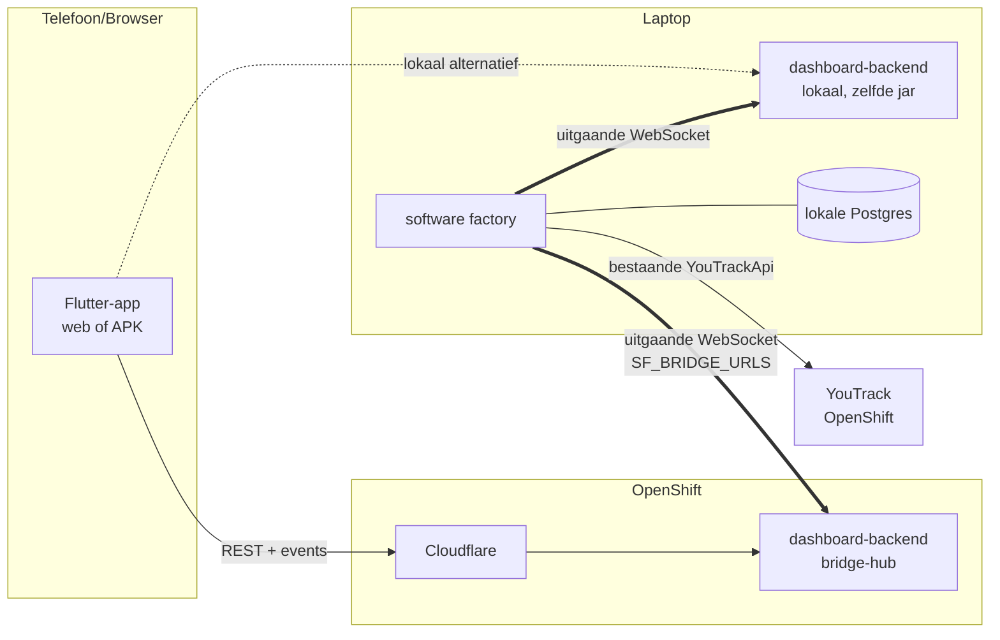

# Ontwerp: bridge-architectuur + nieuwe Flutter-frontend

*Status: ontwerp goedgekeurd om te bouwen, nog niet gestart. Vastgesteld 2026-07-04 door Robbert + Claude.
Dit document is zelfstandig leesbaar en bedoeld als bouwopdracht voor latere (AI-)ontwikkeling, fase voor fase.*

## 1. Doel en aanleiding

De software factory draait **alleen nog lokaal** (laptop); op OpenShift draaien alleen YouTrack en het
Flutter-dashboard (frontend + backend-service). Probleem: de huidige `dashboard-backend` leest rechtstreeks
de factory-database en YouTrack — maar de factory-DB staat sinds juni 2026 lokaal, dus vanaf het cluster is
die niet meer bereikbaar. Bovendien kan het cluster-dashboard niets *doen* met de factory (approve, commands),
alleen meekijken.

**Oplossing**: de factory maakt zelf een **uitgaande** WebSocket-verbinding naar de backend-service (de
"bridge"). De backend wordt een dunne makelaar: de Flutter-app praat REST/WS met de backend, de backend zet
verzoeken door over de socket, de factory voert ze uit en antwoordt. De backend heeft daarna **géén eigen
YouTrack- of database-toegang meer** — alles loopt via de factory. Vervang je ooit YouTrack, dan merken
backend en frontend daar niets van.

Veiligheidsmodel: de laptop luistert nergens op (alleen uitgaande 443), de socket is token-geauthenticeerd,
en het protocol is een expliciete operatie-catalogus — geen generieke proxy.

## 2. Vastgestelde besluiten

| # | Besluit |
|---|---|
| B1 | De factory initieert de verbinding (outbound WebSocket); nooit een tunnel/poort naar de laptop. |
| B2 | De backend-service praat **niet** meer met YouTrack of de factory-DB; uitsluitend via de bridge. Het protocol spreekt **domeintaal** (story/subtaak/fase), geen YouTrack-veldnamen. |
| B3 | Backend + Flutter draaien zowel op OpenShift (via Cloudflare) als lokaal (fallback als cluster/Cloudflare down is). De factory verbindt met **meerdere** bridges tegelijk (`SF_BRIDGE_URLS`, komma-gescheiden). |
| B4 | Single user. De bestaande login (username/password + remember-me-cookie, `AuthService`) blijft het auth-model voor de Flutter-kant. |
| B5 | De bestaande `dashboard-backend`- en `dashboard-frontend`-code wordt **verwijderd en in-place vervangen** (zelfde Maven-module, zelfde mappen, zelfde image-namen) zodat pipelines en deploy-manifests ongewijzigd blijven. Te bewaren uit de oude backend: `AuthService` + secrets-loading (`DashboardSecretsLoader`). Al het andere van de oude Flutter-app wordt vergeten. |
| B6 | De nieuwe frontend hoeft er **niet** hetzelfde uit te zien als het Kotlin-dashboard — functionele pariteit volstaat; dit is juist de kans om de UI te verbeteren (zie §9). |
| B7 | APK's komen uit **publieke** GitHub-releases: de bridge levert alleen de `browser_download_url`; de browser/telefoon downloadt direct van GitHub. (Wordt een repo ooit privé, dan lossen we dat dan op.) |
| B8 | Het Kotlin-dashboard (`web/views`, `web/controllers`) blijft draaien tot de Flutter-app functionele pariteit heeft; daarna wordt het verwijderd. |
| B9 | De Flutter-app moet ook op de telefoon werken (web + Android-APK) en MOET het bestaande cache-busting-mechanisme behouden (zie §9, "Caching"). |

## 3. Architectuurschets



- De factory is de enige die YouTrack en de database kent.
- Beide backends (cluster + lokaal) zijn identiek en tegelijk verbonden; de Flutter-app kiest z'n base-URL.
- GitHub-APK-downloads gaan buiten de bridge om (directe publieke URL's, zie B7).

## 4. Het bridge-protocol

### Transport & authenticatie

- WebSocket (`wss://` naar het cluster, `ws://localhost` lokaal), pad `/bridge`.
- De factory stuurt als eerste frame een **hello**: `{"type":"hello","token":"<SF_BRIDGE_TOKEN>","protocolVersion":1,"factoryVersion":"<git-sha>"}`.
  Token fout → backend sluit de socket. Het token leeft in `secrets.env` (laptop) en als sealed secret (cluster).
- Heartbeat: ping/pong elke 30s; 2 gemiste pongs → verbinding sluiten en opnieuw verbinden.
- Reconnect met exponentiële backoff (1s → max 60s), per bridge-URL onafhankelijk — zelfde discipline als de
  bestaande pollers.

### Frames

Drie frame-soorten, allemaal JSON met een `type`-veld:

```jsonc
// backend → factory: verzoek (correlation-id verplicht)
{"type":"request","id":"r-123","operation":"stories.list","params":{}}

// factory → backend: antwoord op precies één request
{"type":"response","id":"r-123","ok":true,"body":{...}}
{"type":"response","id":"r-123","ok":false,"error":{"code":"STORY_NOT_FOUND","message":"..."}}

// factory → backend: push zonder request (de SSE-vervanger)
{"type":"event","event":"changed"}                       // "er is iets gewijzigd" → frontend ververst
{"type":"event","event":"myActionsCount","body":{"count":3}}
```

- **Timeout**: de backend wacht max 30s op een response; daarna beantwoordt hij de REST-call met een fout.
- **Factory offline**: geen socket verbonden → REST-calls krijgen HTTP 503 met code `FACTORY_OFFLINE`;
  de frontend toont dit als status-banner, niet als error-dialog.
- **Versionering**: `protocolVersion` in de hello; wijzigingen zijn additief (nieuwe operaties/velden;
  onbekende velden negeren — zelfde evolutieregels als het `AgentResultFile`-contract).
- **Binaire data**: alleen screenshots gaan als base64 in een response (met een size-cap en per stuk
  opgevraagd); APK's gaan bewust NIET over de socket (B7).

### Operatie-catalogus

De reads zijn 1-op-1 de bestaande page-data-assemblers in `web/services/FactoryDashboardService` (die
blijven de bron; de bridge-handler roept ze aan en serialiseert het resultaat). De acties zijn de bestaande
POST-endpoints van `web/controllers/FactoryDashboardController` + `FactoryApiController`.

**Reads** (→ bestaand page-data-object als JSON):

| Operatie | Bron (bestaand) |
|---|---|
| `dashboard.get` | `FactoryDashboardService.dashboard()` |
| `stories.list` | `stories()` |
| `story.detail` | `storyDetail(key)` (incl. runs/events/subtaken/briefing-tekst) |
| `story.screenshots` | `screenshots(key)` — metadata; `screenshot.get` levert per attachment base64 |
| `myActions.list` / `myActions.count` | `myActions()` / `myActionsCount()` |
| `agents.list`, `merged.list`, `projects.list`, `nightly.get`, `settings.get` | idem bestaande assemblers |
| `downloads.list` | **nieuw**: per project uit projects.yaml de laatste GitHub-release-assets `*.apk` (naam, tag, publicatiedatum, `browser_download_url`) — via de bestaande GitHubApi van de factory. De oude dashboard-backend had dit al (`GitHubClient.releases/latest`); zelfde gedrag, nu factory-kant. |

**Acties** (→ bestaande service-methodes; retour = ok/fout + evt. nieuwe page-data):

| Operatie | Bron (bestaand) |
|---|---|
| `story.create` | `createStory(...)` (incl. start/autoApprove/silent) |
| `story.setStoryPhase` / `subtask.setPhase` | `setStoryPhase` / `setSubtaskPhase` (antwoorden, approve/reject via fase) |
| `story.setAutoApprove` | `setAutoApproveFlag` |
| `story.command` | `queueCommand` — pause/resume/kill/merge/re-implement/clear-error/retry-current-step/delete/approve/reject |
| `story.purge` | `purgeStory` |
| `story.startRefining` / `story.startDeveloping` | idem |
| `nightly.runNow` / `nightly.stop` / `nightly.createStory` | `NightlyScheduler` + service |
| `project.forceDeploy` | `forceProjectDeploy` |
| `workspace.openInIde` | **verhuist naar de factory** (die draait op de laptop waar IntelliJ staat) — de local-mode-vlag in de backend vervalt |
| `factory.restart` / `factory.stop` | `FactoryProcessService` (nu achter `/api/*`) |

Niet in het protocol: login/logout (dat is backend-lokaal), en de interne agent-endpoints
(`/agent-run/complete` e.d. blijven ongewijzigd in de factory).

## 5. Contract & DTO's

- De wire-DTO's leven in **factory-common**, package `nl.vdzon.softwarefactory.contract.bridge`
  (naast het bestaande `contract/AgentResultFile`): frame-types + één DTO per operatie-body.
  De bestaande `web/models`-page-data-klassen worden hiernaartoe gepromoveerd of gespiegeld —
  keuze bij de bouw: promoveren heeft de voorkeur (één waarheid), spiegelen mag als Modulith dwarsligt.
- **Contract-tests** in factory-common, zelfde recept als `AgentResultFileContractTest`: round-trip,
  letterlijke golden-JSON-payloads, onbekende-velden-tolerantie.
- **Golden fixtures voor Flutter**: de golden-JSON-bestanden staan in de repo
  (`factory-common/src/test/resources/bridge-fixtures/`) en worden óók door Dart-tests ingelezen,
  zodat de Dart-modellen tegen exact dezelfde payloads getest worden als de Kotlin-kant.

## 6. Backend-service (nieuw, in-place in `dashboard-backend`)

Een dunne hub, drie verantwoordelijkheden — bewust niets meer:

1. **Bridge-hub**: WebSocket-endpoint `/bridge` (token-check), administratie van de verbonden factory
   (er is er hooguit één per backend-instantie), request-forwarding met correlation-map + timeouts,
   event-fanout naar de frontend-kant.
2. **Frontend-API**: REST onder `/api/v1/...` (één endpoint per operatie uit §4) + een WebSocket of SSE
   `/api/v1/events` voor de push-events; sessie-auth via de bewaarde `AuthService` (login/remember-me
   zoals nu). Elke call zonder verbonden factory → 503 `FACTORY_OFFLINE`.
3. **Health/status**: `/healthz` (voor k8s-probes) en `/api/v1/status` (factory verbonden? sinds wanneer?
   welke factory-versie?) — voedt de offline-banner in de frontend.

Verwijderd t.o.v. de oude backend: eigen YouTrackClient, DashboardRepository (DB-toegang),
GitHubClient, WorkspaceOpener, `SF_DASHBOARD_LOCAL_MODE`. De sealed secret houdt alleen nog
login-gegevens + `SF_BRIDGE_TOKEN` (geen DB-url, geen YouTrack-token, geen GitHub-token meer — mooie
verkleining van het aanvalsoppervlak in het cluster).

## 7. Factory-kant (nieuw package `bridge/` in softwarefactory)

- `BridgeClient`: verbindt bij opstarten met elke URL uit `SF_BRIDGE_URLS` (leeg = feature uit),
  hello/token, reconnect-backoff, heartbeat. Volgt de soft-fail-filosofie: een kapotte bridge
  mag de factory nooit hinderen.
- `BridgeRequestHandler`: `operation` → aanroep van de **bestaande** services
  (`FactoryDashboardService`, `FactoryOperationsService`, `NightlyScheduler`, `FactoryProcessService`,
  GitHubApi voor downloads). Géén nieuwe businesslogica hier — uitsluitend vertalen en delegeren,
  analoog aan hoe de controllers dat nu doen.
- Push: abonneert op de bestaande `DashboardEventBus`/`FactoryStateChangedEvent` en stuurt `changed`-events
  over alle verbonden bridges.
- Config via `ConfigApi` (`SF_BRIDGE_URLS`, `SF_BRIDGE_TOKEN`); documenteren in
  `docs/factory/secrets-local.md` en `properties.default.env`.

## 8. Migratiefases

Elke fase eindigt groen op `mvn verify` en wordt apart gecommit. De Kotlin-frontend blijft
werken tot en met fase E.

| Fase | Inhoud | Klaar wanneer |
|---|---|---|
| **A. Sloop + skelet** | Oude backend-code en oude Flutter-code verwijderen (behoud `AuthService`, `DashboardSecretsLoader`, module/pipelines/deploy-manifests). Lege Spring Boot-app met `/healthz` + login. Leeg Flutter-project met dezelfde build-targets (web + Android) en het cache-busting-`index.html` (zie §9). | Beide images bouwen en deployen; login werkt; k8s-probes groen. |
| **B. Bridge-fundament** | Protocol-frames + contract-DTO's + contract-tests in factory-common; `BridgeClient`/`BridgeRequestHandler` in de factory; hub in de backend; eerste operatie `stories.list` + `myActions.count` end-to-end; `changed`-push. | Backend-test met fake factory-socket groen; factory-test met fake hub groen; handmatig: Flutter-loze curl-test toont stories-JSON via het cluster. |
| **C. Read-only pariteit** | Alle reads uit §4 + de Flutter-schermen: My actions (startscherm), stories-lijst, story-detail met keten-visualisatie, dashboard, agents, merged, projects, nightly (read), settings (read), screenshots-galerij, downloads (APK-links). Offline-banner + live-refresh op events. | Alle informatie uit het Kotlin-dashboard is in de app te zien. |
| **D. Acties** | Alle acties uit §4, met bevestigings-UX voor destructieve (purge, delete, re-implement). | Een volledige story is van creatie t/m merge/deploy volledig vanaf de telefoon te besturen. |
| **E. Pariteitscheck** | Checklist: elke route/knop van het Kotlin-dashboard heeft een equivalent (of een bewust besluit dat het vervalt). Een paar weken beide gebruiken. | Robbert gebruikt de nieuwe app als primair dashboard. |
| **F. Opruimen** | Kotlin-frontend verwijderen: `web/views`, `web/controllers` (behalve de interne agent-endpoints), auth-interceptor, statics. `FactoryDashboardService` blijft (is de bridge-bron). Docs bijwerken (onboarding, runbook, technical). | `mvn verify` groen; factory draait headless + bridge. |

## 9. De Flutter-app

**Targets**: Flutter web (deploy zoals nu, nginx-image) én Android-APK voor op de telefoon.

**Caching (harde eis, B9)**: het bestaande mechanisme uit `dashboard-frontend/web/index.html`
één-op-één overnemen in de nieuwe app: bij het laden alle service workers unregisteren, alle caches
wissen en `flutter_bootstrap.js` laden met `?v=Date.now()`. Dit loste het "oude versie blijft hangen"-
probleem op; niet vervangen door iets slimmers zonder expliciete test op een echte telefoon.

**UI-richting** (verbeteren mag — geen pixel-kopie van het Kotlin-dashboard):

- **My actions als startscherm**: het dashboard is in de praktijk een inbox; approve/reject/antwoorden
  in één tik, mobiel-eerst.
- **Keten-visualisatie** per story: de subtaakketen (develop → review → test → summary → documentation →
  manual-approve → merge → deploy) als stappenlijn met status-kleuren i.p.v. fase-strings in een tabel.
- **Live**: geen refresh-knoppen; de `changed`-events sturen de UI.
- **Factory-status prominent**: online/offline (+ sinds wanneer) altijd zichtbaar.
- **Screenshots als galerij** bij het testresultaat.
- Bij de start van fase C eerst een paar visuele mockups ter goedkeuring maken voordat schermen
  gebouwd worden.

## 10. Teststrategie

- **Contract**: golden-JSON-fixtures + Kotlin-contract-tests (factory-common) + Dart-tests op dezelfde fixtures.
- **Backend**: unit-/integratietests met een fake factory aan de socket (scriptbare responses), incl.
  timeout- en offline-gedrag; teststijl = handgeschreven fakes zoals de rest van de repo.
- **Factory**: `BridgeRequestHandler`-tests per operatie tegen de bestaande fakes uit `testsupport/`;
  `BridgeClient`-reconnect-test tegen een embedded WS-server.
- **e2e (optioneel, fase D)**: de bestaande e2e-harness uitbreiden met een embedded backend zodat
  "Flutter-actie → bridge → factory → YouTrack-fake" één keten-test wordt.
- **Flutter**: model-tests op de fixtures + een handvol widget-tests voor de actie-flows.

## 11. Risico's en open punten

1. **Screenshots over de socket** (base64) is de minst elegante hoek — size-cap en per-stuk laden;
   accepteren als v1, optimaliseren alleen als het knelt.
2. **Cloudflare-route voor de backend**: er moet een public hostname voor `dashboard-backend` bestaan
   (zelfde patroon als YouTrack); check bij fase A of die er al is.
3. **Token-rotatie**: `SF_BRIDGE_TOKEN` staat op laptop én cluster; bij lek beide roteren (gedocumenteerd
   in secrets-local.md).
4. **APK's privé worden** (B7): dan moet `downloads.list` een door de factory gestreamde download of
   een tijdelijke URL gaan leveren — bewust uitgesteld.
5. **Beide dashboards tijdens C/D**: dubbel onderhoud accepteren; geen nieuwe features in het
   Kotlin-dashboard tijdens de migratie.
