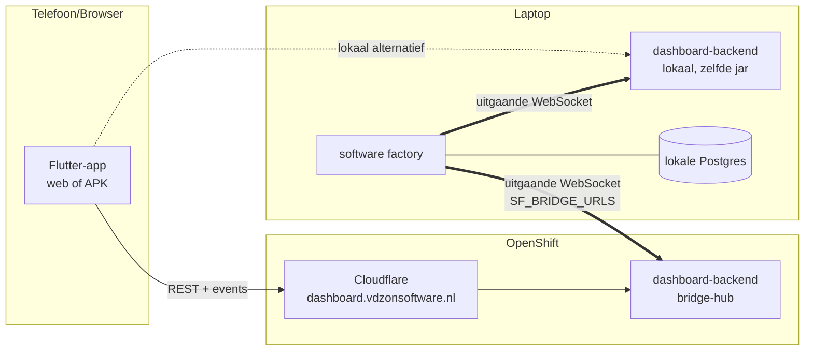

# Bouwopdracht: bridge-architectuur + nieuwe Flutter-frontend

*Status: ontwerp goedgekeurd, bouw nog niet gestart. Vastgesteld 2026-07-04 door Robbert.
Dit document is een **zelfstandige bouwopdracht**: de uitvoerende AI-agent heeft géén andere context
nodig dan dit document plus de repo zelf. Lees eerst §0 en §1 volledig voordat je iets doet.*

---

## 0. Voor de uitvoerende AI-agent — werkafspraken

Je werkt in de repo `softwarefactory` (Kotlin/Spring Boot + Flutter). Houd je aan deze regels:

1. **Bouw fase voor fase** (§8: fases A t/m F). Rond een fase volledig af — inclusief tests en
   `mvn verify` groen — vóór je aan de volgende begint. Ideaal: één fase per sessie, en commit
   per fase met een beschrijvende Nederlandse commit-message.
2. **Verifieer, gis niet.** Alle bestandspaden en methodenamen in dit document zijn gecontroleerd
   op 2026-07-04, maar lees het bestand zelf vóór je het wijzigt. Klopt iets niet meer met dit
   document, volg dan de code en noteer de afwijking in je eindverslag.
3. **Volg de conventies van deze repo** (zie §2). De belangrijkste: Nederlandstalig
   "waarom"-commentaar, géén mock-frameworks (handgeschreven fakes), en gedrag testen in plaats
   van implementatie naspiegelen.
4. **Raak deze onderdelen NIET aan**: de map `work/` (dat zijn gekloonde éxterne repos, geen code
   van dit project!), de module `agentworker`, het package `pipeline/`, de e2e-harness in
   `softwarefactory/src/test/kotlin/nl/vdzon/softwarefactory/e2e/` (behalve als een fase het
   expliciet vraagt), en `docs/stories/` (archief).
5. **Het Kotlin-dashboard blijft werken t/m fase E.** Verwijder tijdens de bouw niets uit
   `softwarefactory/src/main/kotlin/nl/vdzon/softwarefactory/web/` — dat gebeurt pas in fase F.
6. **Testcommando's**: `mvn test` (snel, unit) en `mvn verify` (volledig, incl. e2e met
   Testcontainers — Docker moet draaien). Eén losse e2e-test:
   `mvn -f softwarefactory/pom.xml verify -Dit.test=<Klasse> -Dsurefire.skip=true`.
7. **Twijfel je over een ontwerpkeuze** die dit document niet beantwoordt: maak de conservatieve
   keuze (minste code, dichtst bij bestaande patronen), en documenteer 'm in je verslag.

## 1. Waarom dit project bestaat

De software factory is een Kotlin/Spring Boot-applicatie die tracker-stories (eigen Postgres-tracker)
automatisch uitvoert met AI-agents in Docker-containers. Hij
draait **uitsluitend op Robberts laptop** (via `factory-loop.sh`), met een lokale Docker-Postgres.
Op OpenShift draait alleen het Flutter-dashboard (frontend + backend-service), publiek bereikbaar
via Cloudflare op **https://dashboard.vdzonsoftware.nl/**.

Twee problemen met de huidige opzet:

1. **Het cluster-dashboard kan niet meer bij de data.** De huidige `dashboard-backend` leest
   rechtstreeks de factory-database — maar die is in juni 2026 naar de laptop verhuisd. Vanaf het
   cluster is die onbereikbaar.
2. **Het cluster-dashboard kan niets dóén.** Approve/reject, commands, story's aanmaken — dat kan
   alleen in het lokale Kotlin-dashboard (server-rendered HTML in de factory zelf), en dus alleen
   thuis.

**De oplossing** (en de kern van dit hele project): de factory maakt zelf een **uitgaande**
WebSocket-verbinding naar de backend-service ("de bridge"). De backend wordt een dunne makelaar:
de Flutter-app praat REST met de backend, de backend zet verzoeken door over de socket, de factory
voert ze uit en antwoordt. Daarna:

- heeft de backend **géén eigen tracker- of database-toegang meer** — alles loopt via de factory;
- hoeft de laptop **nooit** inkomend bereikbaar te zijn (alleen uitgaande poort 443) — dit was voor
  Robbert een harde eis, hij wil zijn laptop niet via een tunnel openzetten;
- kan de volledige factory vanaf de telefoon bediend worden;
- maakt het voor frontend en backend niet meer uit wat de tracker is (een tracker-wissel raakt ze niet);
- kan het Kotlin-dashboard uiteindelijk weg (één frontend, minder onderhoud).

Als het cluster of Cloudflare down is: dezelfde backend-jar en Flutter-app draaien ook lokaal op de
laptop, en de factory verbindt met **beide** bridges tegelijk.

## 2. Repo-oriëntatie en conventies

### Modules

| Module/map | Wat het is |
|---|---|
| `factory-common/` | Gedeelde Maven-module: git/github/support/preview/docs-code, `config/FactorySecrets`, `config/ProjectRepoResolver`, en het bestaande wire-contract `contract/AgentResultFile.kt` (+ contract-tests). Hier komen ook de nieuwe bridge-DTO's. |
| `softwarefactory/` | De factory-server zelf (Spring Boot). Belangrijkste packages: `core/` (domein + poorten), `orchestrator/` (poll-loop), `pipeline/` (story/subtaak-state-machine), `runtime/` (Docker-agents + completion), `tracker/`, `telegram/`, `nightly/`, `web/` (het huidige Kotlin-dashboard: controllers, services, views). |
| `agentworker/` | CLI die ín de agent-container draait. **Niet aanraken.** |
| `dashboard-backend/` | De backend-service voor de Flutter-app. Wordt in dit project leeggehaald en opnieuw opgebouwd (fase A). |
| `dashboard-frontend/` | De Flutter-app (web + Android). Wordt in dit project leeggehaald en opnieuw opgebouwd. Bevat `Dockerfile` (Flutter-web-build → nginx) en `nginx.conf`. |
| `deploy/base/` | k8s/OpenShift-manifests voor dashboard-backend en -frontend (deployments, services, route, sealed secret). **Behouden**; alleen de sealed secret verandert van inhoud (fase A). |
| `work/`, `qualityrun/` | Gekloonde externe repos. **Nooit aanraken.** |

### Conventies (afwijken = review-fout)

- **Commentaar**: Nederlands, en alleen "waarom", nooit "wat". Kijk naar bestaande bestanden voor de toon.
- **Tests**: geen MockK/Mockito. Handgeschreven fakes; herbruikbare fakes staan in
  `softwarefactory/src/test/kotlin/nl/vdzon/softwarefactory/testsupport/`. Tests asserten gedrag
  (welke update/welk bericht ging eruit), met Nederlandse testnamen in backticks.
- **Architectuur wordt afgedwongen** door `ModulithArchitectureTest` (Spring Modulith) in de
  softwarefactory-module. Nieuwe packages daar moeten door die test heen komen.
- **Config**: env-vars heten `SF_*`, geladen in lagen `properties.default.env` →
  `properties.env` → `secrets.env` (echte env wint). Nieuwe vars documenteer je in
  `docs/factory/secrets-local.md` en (met default) in `properties.default.env`. In factory-code
  nooit rechtstreeks `System.getenv` — gebruik `ConfigApi.resolvedValues()`.
- **Soft-fail-filosofie**: externe randen (bridge!) falen met `runCatching` + `logger.warn` en
  mogen de factory-kernloop nooit hinderen.

### Sleutelbestanden voor dit project (gecontroleerd 2026-07-04)

| Bestand | Relevantie |
|---|---|
| `softwarefactory/.../web/services/FactoryDashboardService.kt` | Bouwt ALLE page-data die het dashboard toont. Publieke methodes o.a.: `dashboard()`, `stories()`, `storyDetail(key)`, `screenshots(key)`, `myActions()`, `myActionsCount()`, `agents()`, `merged()`, `projectsOverview()`, `nightlyJobs(run)`, `settings()`, `createStory(...)`, `createNightlyStory(...)`, `setAutoApproveFlag(...)`, `saveNightlySettings(...)`, `purgeStory(key)`, `startRefining(key)`, `startDeveloping(key)`, `forceProjectDeploy(name)`, `openWorkspaceInIntellij(key)`. **De bridge hergebruikt deze methodes — schrijf geen nieuwe businesslogica.** |
| `softwarefactory/.../web/services/FactoryOperationsService.kt` | Implementeert de poort `core/FactoryOperations`; heeft `setStoryPhase(key, phase, comment)`, `setSubtaskPhase(key, phase, comment)`, `queueCommand(key, FactoryCommand, reason)`. |
| `softwarefactory/.../web/services/DashboardEventBus.kt` | Implementeert `core/ChangeNotifier`; het "er is iets veranderd"-signaal (voedt nu SSE). De bridge abonneert hierop voor push-events. Zie ook `core/FactoryStateChangedEvent.kt`. |
| `softwarefactory/.../web/models/*.kt` | De page-data-DTO's (`StoriesPageData`, `StoryDetailPageData`, `MyActionsPageData`, …) die het protocol gaat vervoeren. |
| `softwarefactory/.../web/controllers/FactoryDashboardController.kt` | De huidige HTTP-kant; de actie-endpoints hier zijn de referentie voor de operatie-catalogus (§5) — zelfde service-aanroepen, zelfde parameters. |
| `core/FactoryCommand.kt` (in `softwarefactory/.../core/TrackerModels.kt`) | Enum van alle commands: pause, resume, kill, re-implement, clear-error, retry-current-step, delete, merge, approve, reject. |
| `dashboard-backend/.../api/AuthService.kt` + `AuthController.kt` | **Bewaren in fase A**: login met constant-time-vergelijking + remember-me-cookie (HMAC). |
| `dashboard-backend/.../config/DashboardConfig.kt` | **Deels bewaren**: `DashboardSecretsLoader` (secrets.env-parsing). De DataSource/JdbcTemplate-beans en DB-instellingen vervallen. |
| `dashboard-frontend/web/index.html` | Bevat het **cache-busting-script** (service workers unregisteren, alle caches wissen, `flutter_bootstrap.js?v=Date.now()` laden). **Eén-op-één overnemen in de nieuwe app** — dit loste een hardnekkig "oude versie blijft hangen"-probleem op de telefoon op. |
| `factory-common/.../contract/AgentResultFile.kt` + `contract/AgentResultFileContractTest.kt` | Het bestaande wire-contract + contract-test-recept. De bridge-DTO's volgen exact ditzelfde patroon (`@JsonIgnoreProperties(ignoreUnknown = true)`, golden-JSON-tests). |

## 3. Vastgestelde besluiten

| # | Besluit |
|---|---|
| B1 | De factory initieert de verbinding (outbound WebSocket); nooit een tunnel/poort naar de laptop. |
| B2 | De backend-service praat **niet** met de tracker-database of de factory-DB; uitsluitend via de bridge. Het protocol spreekt **domeintaal** (story/subtaak/fase), geen tracker-veldnamen. |
| B3 | Backend + Flutter draaien op OpenShift (https://dashboard.vdzonsoftware.nl/ — deze route bestaat en werkt al) én lokaal. De factory verbindt met **meerdere** bridges tegelijk via `SF_BRIDGE_URLS` (komma-gescheiden). |
| B4 | Single user. Bestaande login (`AuthService`: username/password + remember-me) blijft het auth-model voor de Flutter-kant. **Bijgesteld (SF-794/SF-795):** de username/password-login is vervangen door **Google-SSO (OIDC)** met een vaste e-mail-allowlist (`POST /api/v1/auth/google`, ID-token-verificatie, `SF_ALLOWED_EMAILS`); het HMAC-sessie-token/remember-me-mechanisme blijft, maar de identiteit is nu het geverifieerde e-mailadres. Zie `docs/technical/endpoints.md` §Authenticatie. |
| B5 | Oude `dashboard-backend`- en `dashboard-frontend`-code wordt **in-place vervangen**: zelfde Maven-module, zelfde mappen, zelfde image-namen (`ghcr.io/robbertvdzon/softwarefactory-dashboard-backend:main` resp. `-frontend:main`) zodat pipelines en manifests blijven werken. Bewaren: `AuthService`, `AuthController`, `DashboardSecretsLoader`. Rest weg. |
| B6 | De nieuwe frontend hoeft er **niet** uit te zien als het Kotlin-dashboard — functionele pariteit volstaat; de UI mag juist beter (zie §9). |
| B7 | APK's komen uit **publieke** GitHub-releases: de bridge levert alleen naam/tag/datum + `browser_download_url`; de browser downloadt direct van GitHub. (Wordt een repo ooit privé → dan pas oplossen.) |
| B8 | Het Kotlin-dashboard blijft draaien tot de Flutter-app functionele pariteit heeft (fase E); daarna pas verwijderen (fase F). |
| B9 | De Flutter-app moet op de telefoon werken (web + Android-APK) en MOET het cache-busting-mechanisme uit `dashboard-frontend/web/index.html` behouden. |

## 4. Architectuurschets



- De factory is de enige die de tracker-database kent.
- GitHub-APK-downloads gaan buiten de bridge om (directe publieke URL's, B7).

## 5. Het bridge-protocol

### Transport & authenticatie

- WebSocket (`wss://` cluster, `ws://localhost:<poort>` lokaal), pad `/bridge`.
- Eerste frame van de factory is een **hello**:
  `{"type":"hello","token":"<SF_BRIDGE_TOKEN>","protocolVersion":1,"factoryVersion":"<git-sha>"}`.
  Token fout → backend sluit de socket. Token leeft in `secrets.env` (laptop) én in de sealed
  secret van het cluster (`deploy/base/sealed-secret-dashboard.yaml`; hersealen via `deploy/seal-secrets.sh`).
- Heartbeat: ping/pong elke 30s; 2 gemiste pongs → sluiten en herverbinden.
- Reconnect met exponentiële backoff (1s → max 60s), per bridge-URL onafhankelijk.

### Frames

Drie soorten, allemaal JSON met een `type`-veld:

```jsonc
// backend → factory (correlation-id verplicht)
{"type":"request","id":"r-123","operation":"stories.list","params":{}}

// factory → backend: antwoord op precies één request
{"type":"response","id":"r-123","ok":true,"body":{...}}
{"type":"response","id":"r-123","ok":false,"error":{"code":"STORY_NOT_FOUND","message":"..."}}

// factory → backend: push zonder request (de SSE-vervanger)
{"type":"event","event":"changed"}
{"type":"event","event":"myActionsCount","body":{"count":3}}
```

Regels:

- Backend wacht max 30s op een response; daarna faalt de bijbehorende REST-call netjes.
- Geen socket verbonden → REST-calls geven HTTP 503 met code `FACTORY_OFFLINE`; de frontend toont
  dat als status-banner, niet als foutdialoog.
- Evolutie is **additief**: nieuwe operaties/velden mogen; bestaande veldnamen wijzigen niet;
  beide kanten negeren onbekende velden (`@JsonIgnoreProperties(ignoreUnknown = true)`).
- Binaire data: alleen screenshots, als base64 in een response, per stuk opgevraagd, met size-cap.
  APK's gaan bewust NIET over de socket (B7).

### Operatie-catalogus

De reads leveren de bestaande page-data-objecten (als JSON); de acties roepen de bestaande
service-methodes aan. **Referentie-implementatie voor parameters en gedrag: de huidige
`FactoryDashboardController` — de bridge doet per operatie exact wat het overeenkomstige
endpoint daar doet.**

**Reads:**

| Operatie | Delegeert naar |
|---|---|
| `dashboard.get` | `FactoryDashboardService.dashboard()` |
| `stories.list` | `stories()` |
| `story.detail` | `storyDetail(key)` |
| `story.screenshots` | `screenshots(key)` (metadata); `screenshot.get` levert per attachment base64 |
| `myActions.list` / `myActions.count` | `myActions()` / `myActionsCount()` |
| `agents.list` / `merged.list` / `projects.list` / `nightly.get` / `settings.get` | `agents()` / `merged()` / `projectsOverview()` / `nightlyJobs(run)` / `settings()` — **SF-890:** `projectsOverview()` levert per project sindsdien ook `buildStatus` (laatste main-build-tijdstip, main/PR-build-actief, in-sync/out-of-sync t.o.v. `prdVersion`), afgeleid uit dezelfde `GitHubActionsClient` als `builds.list` hieronder; geen nieuwe operatie of endpoint. |
| `downloads.list` | **nieuw te bouwen aan factory-kant**: per project uit projects.yaml de assets `*.apk` van de laatste GitHub-release (naam, tag, publicatiedatum, `browser_download_url`), via de bestaande `GitHubApi` in factory-common. De oude dashboard-backend deed dit al via `GET /repos/<slug>/releases/latest` (zie git-historie van `dashboard-backend/.../github/GitHubClient.kt` als voorbeeld). |
| `builds.list` / `builds.runs` | **SF-876:** `FactoryDashboardService.builds()` / `.buildsFor(owner, repo)` — laatste GitHub Actions-run per workflow, per beheerd repo (`GitHubActionsClient`, `GET /repos/<slug>/actions/runs`), gecached per repo-slug (TTL 30s). `builds.list` levert alle beheerde repo's (Builds-scherm); `builds.runs` levert er één (`GET /api/v1/repositories/{owner}/{repo}/workflows` en `/runs` in dashboard-backend). `dashboard.get` bevat sindsdien ook `attentionBuilds`: runs op de default branch met `conclusion == failure`. |
| `agent.log` | **SF-1038:** `agentLog(agentRunId)` — laatste (begrensd op 500) `docker-stdout`/`docker-stderr`-regels van één agent-run, chronologisch geordend (oudste eerst), via de geëxposeerde runtime-poort `AgentLogApi`/`AgentLogService` (de dashboard-module mag `runtime.repositories.AgentEventRepository` niet rechtstreeks injecteren, zelfde Modulith-grens als `SubtaskMaterializationApi`). Endpoint `GET /api/v1/agents/{agentRunId}/events`; de Agents-tab-tile is klikbaar en opent hiermee een logdetailscherm dat voor actieve runs periodiek pollt en voor afgeronde runs eenmalig laadt. |
| `status.get` | door de backend zélf beantwoord (factory verbonden? sinds? factoryVersion?) — geen bridge-call |
| `assistant.status` | `TelegramAssistantService.status()` (§E-nazorg 2026-07-05) — de Telegram-assistent draait niet als agent-run met een story-koppeling (geen `agent_runs`-rij), dus was hij onzichtbaar op het Agents-scherm. Nieuwe operatie levert `enabled`/`busy`/`activeChatCount`/`lastActivityAt` uit een klein bijgehouden statusje in de service zelf (geen DB-tabel nodig). |

**Acties:**

| Operatie | Delegeert naar |
|---|---|
| `story.create` | `createStory(project, title, description, repo, aiSupplier, aiModel, start, autoApprove, silent)` — **SF-818:** `projectKey` is optioneel (het "Nieuwe story"-dialoog stuurt 'm niet meer mee); ontbreekt hij, dan valt de service terug op het enige geconfigureerde project. |
| `story.setStoryPhase` / `subtask.setPhase` | `FactoryOperationsService.setStoryPhase` / `.setSubtaskPhase` (zo lopen antwoorden op vragen én approve/reject via fasen) |
| `story.setAutoApprove` | `setAutoApproveFlag(key, enabled)` |
| `story.command` | `FactoryOperationsService.queueCommand(key, FactoryCommand, reason)` — commands: pause/resume/kill/re-implement/clear-error/retry-current-step/delete/merge/approve/reject |
| `story.purge` | `purgeStory(key)` — DESTRUCTIEF: frontend vraagt bevestiging |
| `story.startRefining` / `story.startDeveloping` | idem service |
| `nightly.runNow` / `nightly.stop` | `NightlyScheduler.startManualRun()` / `.stopActiveRun()` |
| `nightly.createStory` / `nightly.saveSettings` | `createNightlyStory(project, jobName)` / `saveNightlySettings(...)` |
| `project.forceDeploy` | `forceProjectDeploy(name)` |
| `workspace.openInIde` | `openWorkspaceInIntellij(key)` — draait op de laptop (waar IntelliJ staat), dus dit werkt in het nieuwe model juist overal vandaan |
| `factory.restart` / `factory.stop` | `FactoryProcessService` (zie `web/controllers/FactoryApiController.kt` voor het huidige gedrag) |

Niet in het protocol: login/logout (backend-lokaal) en de interne agent-endpoints van de factory
(`/agent-run/complete` e.d. blijven ongewijzigd).

## 6. Contract & DTO's

- Wire-DTO's in **factory-common**, package `nl.vdzon.softwarefactory.contract.bridge`:
  de frame-types (hello/request/response/event) + per operatie een body-DTO.
- De bestaande page-data-klassen uit `softwarefactory/.../web/models/` worden bij voorkeur naar dit
  contract-package **gepromoveerd** (één waarheid). Als Spring Modulith daarover struikelt: spiegelen
  mag, mét een comment die naar de bron verwijst.
- **Contract-tests** in factory-common, zelfde recept als `AgentResultFileContractTest`:
  round-trip met alle velden, letterlijke golden-JSON-payloads, minimale payload → defaults,
  onbekende velden → genegeerd.
- **Golden fixtures voor Flutter**: de golden-JSON-bestanden staan in
  `factory-common/src/test/resources/bridge-fixtures/` en worden óók door de Dart-tests van de
  Flutter-app ingelezen, zodat beide kanten tegen exact dezelfde payloads testen.

## 7. De twee nieuwe componenten

### Backend-service (in-place nieuw in `dashboard-backend`)

Dunne hub met precies drie verantwoordelijkheden:

1. **Bridge-hub**: WebSocket-endpoint `/bridge` (token-check bij hello), administratie van de
   verbonden factory (hooguit één per backend-instantie; een nieuwe verbinding vervangt de oude),
   request-forwarding met correlation-map + timeout, event-doorgifte naar de frontend-kant.
2. **Frontend-API**: REST onder `/api/v1/...` (één endpoint per operatie uit §5) + `/api/v1/events`
   (SSE of WebSocket) voor de push-events; sessie-auth via de bewaarde `AuthService`.
   Geen factory verbonden → 503 `FACTORY_OFFLINE`.
3. **Health/status**: `/healthz` voor k8s-probes; `/api/v1/status` voor de offline-banner.

Wat verdwijnt uit de oude backend: de eigen tracker-client, `database/` (DashboardRepository,
PreviewUrlResolver), `github/GitHubClient.kt`, `api/WorkspaceOpener.kt`, `api/DashboardController.kt`,
`api/ApiModels.kt`, en alle DB/tracker/GitHub-instellingen uit `DashboardConfig`. De sealed secret
houdt alleen nog: login-gegevens + `SF_BRIDGE_TOKEN`.

### Factory-kant (nieuw package `bridge/` in softwarefactory)

- `BridgeClient`: verbindt bij het opstarten met elke URL uit `SF_BRIDGE_URLS` (leeg = feature uit),
  hello/token, heartbeat, reconnect-backoff. Soft-fail: een kapotte bridge mag de factory nooit hinderen.
- `BridgeRequestHandler`: `operation` → aanroep van de bestaande services (§5). Uitsluitend vertalen
  en delegeren — géén nieuwe businesslogica (behalve `downloads.list`, die is nieuw).
- Push: abonneert op `DashboardEventBus`/`FactoryStateChangedEvent` en stuurt `changed`-events over
  alle verbonden bridges.
- Config: `SF_BRIDGE_URLS` en `SF_BRIDGE_TOKEN` via `ConfigApi`; documenteren in
  `docs/factory/secrets-local.md` + default (leeg) in `properties.default.env`.
- Let op Modulith: het nieuwe `bridge/`-package importeert `web/services` (voor
  FactoryDashboardService) — check `ModulithArchitectureTest`; als die een cycle ziet, injecteer via
  een poort-interface in `core/` (zelfde trick als `core/FactoryOperations`).

## 8. Migratiefases

Elke fase eindigt met `mvn verify` groen en een eigen commit. Kotlin-dashboard blijft
werken t/m fase E.

| Fase | Inhoud | Klaar wanneer (hard criterium) |
|---|---|---|
| **A. Sloop + skelet** | `dashboard-backend`: alles verwijderen behalve `AuthService`, `AuthController`, `DashboardSecretsLoader` (+ hun tests); lege Spring Boot-app met `/healthz` + werkende login. `dashboard-frontend`: `lib/` leeg + nieuw minimal Flutter-project met **web + Android**-targets; `web/index.html` cache-busting-script overnemen; `Dockerfile` + `nginx.conf` blijven werken. Sealed secret terugbrengen tot login + `SF_BRIDGE_TOKEN`. | Beide images bouwen; `mvn verify` groen; login werkt; k8s-manifests ongewijzigd inzetbaar. |
| **B. Bridge-fundament** | Frame-DTO's + contract-tests + fixtures (factory-common); `BridgeClient` + `BridgeRequestHandler` (factory); hub + `/api/v1/stories` + `/api/v1/my-actions/count` + `/api/v1/status` + events-kanaal (backend). Eerste operaties: `stories.list`, `myActions.count`, `changed`-push. | Backend-tests met fake factory-socket groen; factory-tests met fake hub groen (reconnect getest); met `curl` (na login) levert het cluster-endpoint stories-JSON van de laptop-factory. |
| **C. Read-only pariteit** | Alle reads uit §5 + Flutter-schermen: My actions (startscherm), stories, story-detail met keten-visualisatie, dashboard, agents, merged, projects, nightly, settings, screenshots-galerij, downloads (APK-links). Offline-banner + live-refresh op `changed`. Begin met mockups ter goedkeuring aan Robbert. | Alle informatie die het Kotlin-dashboard toont is in de app te zien. |
| **D. Acties** | Alle acties uit §5, met bevestigings-UX voor destructieve (purge, delete, re-implement, factory.stop). | Een story is van aanmaken t/m merge/deploy volledig vanaf de telefoon te besturen. |
| **E. Pariteitscheck** | Checklist: elke route/knop van het Kotlin-dashboard heeft een equivalent óf een genoteerd besluit dat hij vervalt. Robbert gebruikt beide een tijdje naast elkaar. | Robbert bevestigt: de nieuwe app is primair. |
| **F. Opruimen** | Kotlin-frontend weg: `web/views/`, `web/config/DashboardAuthConfig.kt`, de dashboard-routes uit `web/controllers/` (LET OP: `AgentRunCompletionController` en `FactoryApiController` blijven — interne endpoints). `FactoryDashboardService` blijft (bron van de bridge). Docs bijwerken: `docs/onboarding-senior-developer.md`, `runbook.md`, `docs/technical/modules.md` + `endpoints.md`. | `mvn verify` groen; factory draait headless + bridge; docs kloppen. |

## 9. De Flutter-app

**Targets**: Flutter web (nginx-image, zoals nu) én Android-APK voor op de telefoon.

**Caching (harde eis, B9)**: neem het script uit het huidige `dashboard-frontend/web/index.html`
één-op-één over: bij het laden alle service workers unregisteren, alle caches wissen, en
`flutter_bootstrap.js` laden met `?v=` + timestamp. Dit loste een hardnekkig probleem op waarbij de
telefoon oude versies bleef tonen. Niet vervangen door iets anders zonder test op een echte telefoon.

**UI-richting** (verbeteren mag en is gewenst — geen kopie van het Kotlin-dashboard):

- **My actions als startscherm**: het dashboard is in de praktijk een inbox ("wat wacht op mij?");
  approve/reject/antwoorden in één tik, mobiel-eerst.
- **Keten-visualisatie** per story: de subtaakketen (development → review → test → summary →
  documentation → manual-approve → merge → deploy) als stappenlijn met statuskleuren.
- **Live**: geen refresh-knoppen; de `changed`-events sturen de UI.
- **Factory-status prominent**: online/offline + sinds wanneer, altijd zichtbaar.
- **Screenshots als galerij** bij het testresultaat.
- Fase C begint met een paar visuele mockups ter goedkeuring vóór er schermen gebouwd worden.

## 10. Teststrategie

- **Contract**: golden-JSON-fixtures + Kotlin-contract-tests (factory-common) + Dart-tests op
  dezelfde fixtures.
- **Backend**: tests met een scriptbare fake factory aan de socket (handgeschreven fake, geen
  mock-framework), incl. timeout-, reconnect- en offline-gedrag.
- **Factory**: `BridgeRequestHandler`-tests per operatie tegen de bestaande fakes uit
  `testsupport/`; `BridgeClient`-reconnect-test tegen een embedded WebSocket-servertje.
- **Flutter**: model-tests op de fixtures + widget-tests voor de actie-flows.
- **e2e (optioneel, in fase D)**: de bestaande e2e-harness uitbreiden met een embedded backend
  zodat "REST-call → bridge → factory → fake-tracker" één ketentest wordt. Alleen doen als het
  zonder grote verbouwing van de harness kan.

## 11. Risico's en open punten

1. **Screenshots over de socket** (base64) is de minst elegante hoek — size-cap en per stuk laden;
   accepteren als v1.
2. **Token-rotatie**: `SF_BRIDGE_TOKEN` staat op laptop én cluster; bij lek beide roteren
   (documenteren in secrets-local.md).
3. **APK's privé worden** (B7): dan moet `downloads.list` een gestreamde download of tijdelijke URL
   leveren — bewust uitgesteld.
4. **Dubbel onderhoud tijdens C/D**: geen nieuwe features in het Kotlin-dashboard tijdens de
   migratie.
5. ~~Cloudflare-route voor de backend~~ — opgelost: https://dashboard.vdzonsoftware.nl/ bestaat en
   werkt al.

## 12. Fase E — pariteitscheck (2026-07-04)

Elke route/knop van het Kotlin-dashboard (`web/controllers/FactoryDashboardController.kt` +
`web/views/pages/*`) langsgelopen tegen de Flutter-app. Gevonden gaten zijn gedicht (geen nieuwe
bridge-operaties nodig — de data zat al in `story.detail`/`dashboard.get`):

- **Briefing-pagina** (agent-run-samenvattingen + gebruikers-antwoorden, chronologisch): had geen
  Flutter-equivalent. Toegevoegd als sectie op de storydetail-pagina (`_BriefingPanel`) i.p.v. een
  eigen route — bouwt op `allAgentRuns` + `issue.comments`/`subtask.comments`, al onderdeel van
  `story.detail`.
- **"Start refining" / "Start developing"**-knoppen: de bridge-operaties (`story.startRefining`/
  `story.startDeveloping`) bestonden al sinds fase C/D maar waren niet aan de UI gekoppeld.
  Toegevoegd aan de storydetail-pagina met dezelfde zichtbaarheidsregels als het Kotlin-dashboard
  (lege storyPhase resp. `planning-approved` met ongestarte subtaken).
- **Story-omschrijving**: de volledige `description` van de story ontbrak op de detailpagina.
  Toegevoegd als sectie.
- **AI-supplier/AI-model** in het nieuwe-story-formulier: ontbraken (alleen project/titel/
  omschrijving/repo/auto-approve/start). Toegevoegd (suppliers/modellen 1-op-1 overgenomen van
  `core/AiRouting.kt`, hier gedupliceerd als Dart-constanten omdat er geen bridge-operatie is die
  deze catalogus opvraagt).
- **Dashboard-pagina**: miste de metrics "Open story-runs"/"Laatste run" en de "Recente runs"-lijst
  (alleen "Stories"/"Actieve agents" + actieve-agents-lijst waren er). Aangevuld — data zat al in
  `dashboard.get`.
- **"Open in IntelliJ"** op de My-actions-groepskaart: toegevoegd naast de bestaande knop op de
  storydetail-pagina (klein, maar 1-op-1 met het Kotlin-dashboard).

Bewust *niet* overgenomen (vervalt, met reden):

- **Bucket-filter-checkboxes** op de stories-pagina (finished/in-progress/todo tonen/verbergen):
  puur cosmetisch client-side filter, standaard toch alles aan; niet kritiek voor mobiel-eerst
  gebruik. Kan later alsnog als Robbert het mist.
- **Token-budget-popover** (percentage-balk met used/budget/over) op de storydetail-pagina: de
  Flutter-detailpagina toont de kostenschatting al in het Details-blok (`Kosten`); de extra
  budget-visualisatie is bewust weggelaten als niet-essentiële verfijning.
- **Subtaken-lijst als aparte sectie**: vervangen door de Keten-visualisatie (§9) — een bewuste
  verbetering, geen gat.

`mvn verify` groen op alle drie de modules (ongewijzigd t.o.v. fase D, want fase E raakte alleen
`dashboard-frontend`); `flutter analyze` + `flutter test` groen. Handmatig geverifieerd met
Docker-containers + fake-factory-websocket-client (Briefing-sectie, start-refining/developing-
zichtbaarheid, AI-supplier/model-dropdowns, Dashboard-metrics).
