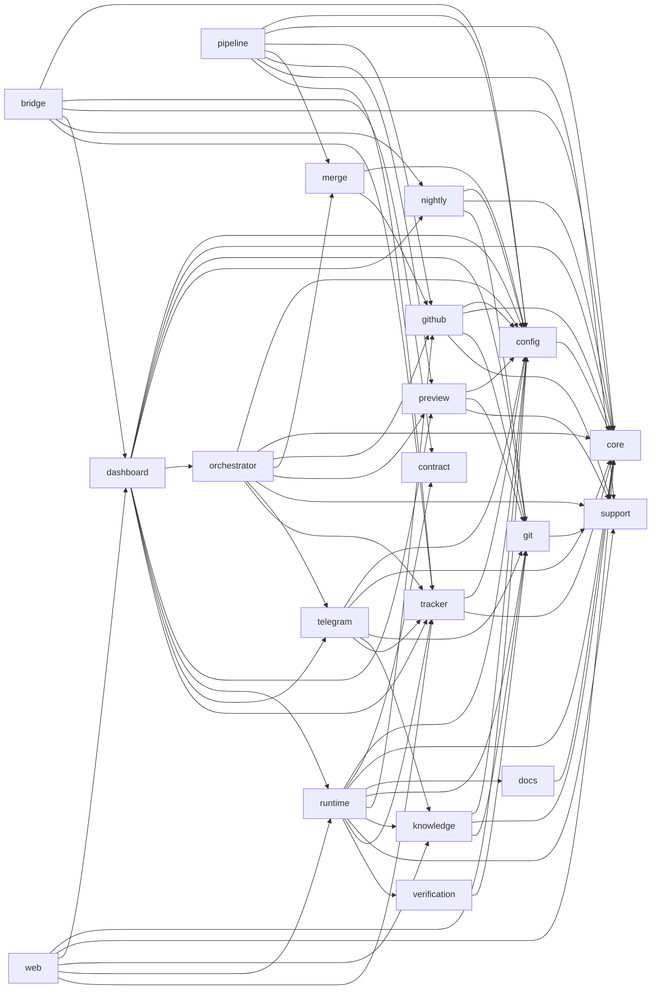

# Spring Modulith dependency-matrix

Deze pagina wordt deterministisch gegenereerd uit de `allowedDependencies` in de
`package-info.java`-bestanden. Wijzig de metadata en draai `tools/generate-module-dependencies`;
`tools/generate-module-dependencies --check` bewaakt documentatiedrift.

| Module | Verantwoordelijkheid | Toegestane publieke dependencies | Motivatie |
|---|---|---|---|
| `bridge` | Bridge transportadapter naar application-API's | `config`, `contract`, `core :: contracts`, `dashboard`, `dashboard :: models`, `nightly`, `tracker` | Gebruikt uitsluitend de genoemde root-API's/named interfaces voor zijn use-cases. |
| `config` | Configuratie, secrets en composition-root wiring | `core`, `core :: contracts` | Gebruikt uitsluitend de genoemde root-API's/named interfaces voor zijn use-cases. |
| `contract` | Supplierneutrale wirecontracten | — | Pure leafmodule zonder uitgaande moduledependency. |
| `core` | Domeintypes en applicatiepoorten | — | Pure leafmodule zonder uitgaande moduledependency. |
| `dashboard` | Dashboard use-cases en publieke read/write-poorten | `config`, `core`, `core :: contracts`, `git`, `nightly`, `nightly :: models`, `nightly :: repositories`, `nightly :: services`, `nightly :: types`, `orchestrator`, `preview`, `runtime`, `runtime :: models`, `telegram`, `telegram :: models`, `tracker`, `tracker :: errors` | Gebruikt uitsluitend de genoemde root-API's/named interfaces voor zijn use-cases. |
| `docs` | Factory-documentatie laden en installeren | `core` | Gebruikt uitsluitend de genoemde root-API's/named interfaces voor zijn use-cases. |
| `git` | Lokale Git-operaties | `support` | Gebruikt uitsluitend de genoemde root-API's/named interfaces voor zijn use-cases. |
| `github` | GitHub-integratie | `config`, `core`, `git`, `support` | Gebruikt uitsluitend de genoemde root-API's/named interfaces voor zijn use-cases. |
| `knowledge` | Persistente agentkennis | `config`, `core`, `git` | Gebruikt uitsluitend de genoemde root-API's/named interfaces voor zijn use-cases. |
| `merge` | Pull-request mergebeleid | `config`, `github` | Gebruikt uitsluitend de genoemde root-API's/named interfaces voor zijn use-cases. |
| `nightly` | Planning en uitvoering van nachtelijke jobs | `config`, `core`, `core :: contracts`, `git` | Gebruikt uitsluitend de genoemde root-API's/named interfaces voor zijn use-cases. |
| `orchestrator` | Procescoördinatie en handmatige commando's | `config`, `core`, `core :: contracts`, `github`, `merge`, `preview`, `support`, `telegram`, `tracker`, `tracker :: errors` | Gebruikt uitsluitend de genoemde root-API's/named interfaces voor zijn use-cases. |
| `pipeline` | Story- en subtaskfaseovergangen | `config`, `core`, `core :: contracts`, `github`, `merge`, `preview`, `support`, `tracker` | Gebruikt uitsluitend de genoemde root-API's/named interfaces voor zijn use-cases. |
| `preview` | Previewomgevingen | `config`, `git`, `support` | Gebruikt uitsluitend de genoemde root-API's/named interfaces voor zijn use-cases. |
| `runtime` | Agentprocessen, workspaces en completion | `config`, `contract`, `core`, `core :: contracts`, `docs`, `git`, `github`, `knowledge`, `knowledge :: models`, `support`, `tracker`, `verification` | Gebruikt uitsluitend de genoemde root-API's/named interfaces voor zijn use-cases. |
| `support` | Gedeelde technische primitives | — | Pure leafmodule zonder uitgaande moduledependency. |
| `telegram` | Telegram-assistent en notificatieadapter | `config`, `core`, `core :: contracts`, `git`, `knowledge`, `knowledge :: models`, `tracker` | Gebruikt uitsluitend de genoemde root-API's/named interfaces voor zijn use-cases. |
| `tracker` | Issue-, comment- en attachmentpoorten | `config`, `core`, `core :: contracts` | Gebruikt uitsluitend de genoemde root-API's/named interfaces voor zijn use-cases. |
| `verification` | Checkout- en verificatieconfiguratie | `git` | Gebruikt uitsluitend de genoemde root-API's/named interfaces voor zijn use-cases. |
| `web` | HTTP-transportadapter | `config`, `core`, `core :: contracts`, `dashboard`, `dashboard :: models`, `knowledge`, `knowledge :: models`, `runtime`, `runtime :: models`, `runtime :: types`, `tracker`, `tracker :: errors` | Gebruikt uitsluitend de genoemde root-API's/named interfaces voor zijn use-cases. |

## Gegenereerd dependencydiagram

`web` en `bridge` zijn onafhankelijke transportadapters. `bridge` bereikt Telegramstatus via
de dashboard-applicationport; geen transportmodule importeert een andere transportmodule.
