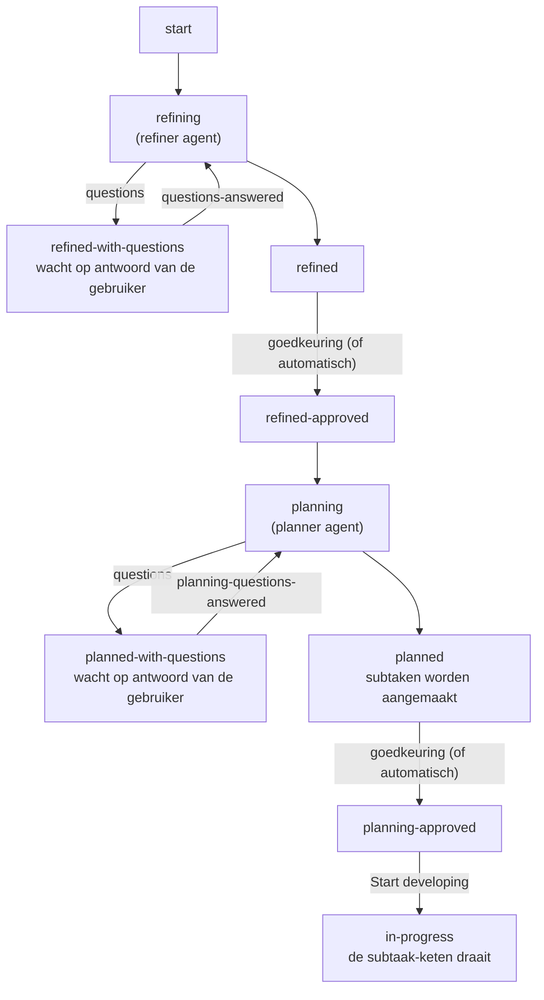
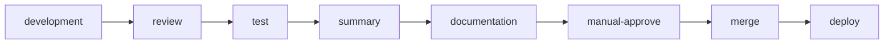
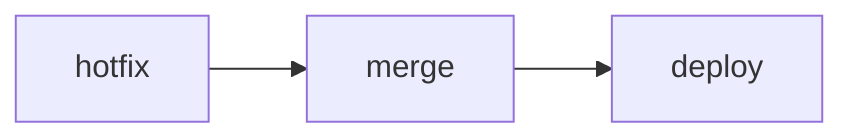

# Overzicht

Software Factory is een Spring Boot 3 / Kotlin applicatie die AI-agenten orkestreert voor werk uit de eigen tracker-database (Postgres). De applicatie bewaart run-status in PostgreSQL, start agenten als Docker-containers, laat die agenten werken in target GitHub repositories en synchroniseert resultaten terug naar de tracker-database en GitHub.

## Hoofdcomponenten

- Web dashboard: ingebouwde HTML-pagina's (login, dashboard, stories, my-actions, projects, agents, merged, downloads, settings) plus een aparte `dashboard-backend`/`dashboard-frontend` (Flutter) als extern dashboard — inclusief de Audits-tab (rapporten + memory-tips).
- Orchestrator/pipeline: pollt de eigen tracker-database en stuurt het twee-laags procesmodel aan — `Story Phase` (refine/plan) op story-niveau en `Subtask Type`/`Subtask Phase` (de subtaak-keten) op subtaak-niveau.
- Agent runtime: start Docker containers met taakcontext, agent tips, secrets en repository-informatie.
- Agent worker CLI: draait binnen de container, bereidt de target repo voor, roept de gekozen AI supplier aan en schrijft `agent-result.json`.
- Persistence: PostgreSQL via JDBC en Flyway voor story runs, agent runs, events, kennis, verwerkte comments, Telegram-state en de audit-scheduler.
- Integraties: PostgreSQL (tracker-database), Git/GitHub CLI, Docker CLI, AI-CLI's (Claude Code/Codex/Copilot), Telegram Bot API en OpenShift/Kubernetes CLI voor previews/deploy-status.

## End-to-end flow

1. `OrchestratorPoller` (daemon-thread) roept `OrchestratorService.pollOnce()` aan.
2. `PostgresTrackerClient.findWorkIssues()` (intern `findAiIssues()`) zoekt issues in de geconfigureerde projecten (`SF_TRACKER_PROJECTS`, of alle projecten als die leeg is); `StoryPipelineService` filtert op een actieve `AI-supplier` (niet leeg/niet `none`), `Paused` en `Error`. Er is geen `Stage`-veldfilter en geen work-tag meer: de fase-gate bepaalt of een issue wordt opgepakt (lege fase = niet starten, `start` = oppakken). De query is een `UNION` van de top-N op `updated_at DESC` (de normale "recent bijgewerkt"-window, die rijen met een afgeronde `status` uitsluit via `core.FinishedStatus` — `done`/`fixed`/`verified`/`closed`/`resolved`, genormaliseerd lowercase), alle issues met een niet-terminale `subtask_phase` (begrensd via `PENDING_SUBSET_LIMIT`, 500) en ongelimiteerd alle issues met `retry_after`. Zo blijven zowel menselijke wachtmomenten als stories/subtaken die automatisch op Claude-quota wachten bereikbaar buiten de recente window en na een lange wachttijd.
3. `StoryPipelineService` routeert op het `Type`-veld: een story gaat naar `StoryRefinementCoordinator` (refine- en plan-stap op `Story Phase`), een subtaak naar `SubtaskExecutionCoordinator` (de keten op `Subtask Phase`).
4. Voor een agent-stap zet de coordinator de fase op de actieve waarde (`refining`, `planning`, `developing`, `reviewing`, `testing`, `summarizing`, `documenting`) en dispatcht via `AgentDispatcher`.
5. `StoryWorkspaceService` maakt of hergebruikt de story-workspace en de gedeelde story-branch; vóór een developer-run merget de factory de laatste main in de branch. `DockerAgentRuntime` schrijft taakcontext, agent tips en env, en start een agentcontainer (`agent:local`).
6. `AgentCli` (agentworker) draait in de container, bereidt de target repository voor en roept via `AiClientFactory` de AI-CLI aan; voor `mock` wordt een dummy resultaat gemaakt.
7. De agent laat wijzigingen uncommitted in de working tree staan; de agentworker faalt de run als de agent zelf een commit maakt. Het resultaat (outcome, usage, events, knowledge-updates en optioneel het laatste Claude-`rate_limit_event`) gaat naar `/work/agent-result.json` (gedeeld contract-DTO `AgentResultFile` in `factory-contracts`).
8. `AgentResultFileCompletionPoller` ziet dat de container klaar is en leest het resultaatbestand.
9. `AgentRunCompletionService.complete()` sluit de agent run: commit en pusht wijzigingen (altijd — er is geen uitgestelde sync meer), opent of hergebruikt een GitHub PR, schrijft events, werkt de fase in de tracker-database bij en materialiseert bij een planner-run de subtaken (`SubtaskPlanMaterializer`, inclusief de afgedwongen documentation-, manual-approve-, merge- en deploy-subtaken). Een mislukte Claude-run met een blokkerend quotasignaal houdt de actieve fase en een leeg `Error`, zet `retry_after` en wordt na dat tijdstip automatisch als dezelfde rol hervat; deze runs tellen niet mee in de transient-retryreeks en onderbreken die ook niet.
10. Zodra een subtaak zijn terminale fase bereikt, zet de keten de volgende subtaak op `start`. De merge-subtaak merget de PR automatisch (squash); de deploy-subtaak volgt de deploy-config uit `projects.yaml`.
11. Telegram meldt uitsluitend de concrete events uit `notification_events`; `QUOTA_WAIT` gebruikt daarbij een idempotente Claude-quota-wachtstatus. Het accepteert antwoorden en commands als reply. Het dashboard toont openstaande menselijke acties op `/my-actions` en quota-wachten als afzonderlijke amber status, niet als fout.

## Belangrijkste fasen

Twee-laags model (zie `core/StoryPhase.kt` en `core/SubtaskPhase.kt`):

- **`Story Phase`**: `start → refining → refined[-with-questions] → refined-approved → planning → planned[-with-questions] → planning-approved → in-progress`, met reject-varianten (`refined-rejected`, `planning-rejected`) en antwoord-fasen (`questions-answered`, `planning-questions-answered`).
- **`Subtask Phase`**: per stap het patroon `start → *-ing → (*-with-questions ↔ *-questions-answered) → *-ed → *-approved | *-rejected`; niet-AI-stappen hebben eigen fasen (`awaiting-human`/`manual-action-done`, `manual-approve-needed`/`manually-approved`, `merging`/`merge-approved`, `deploying`/`deploy-approved`/`deploy-failed`). De `hotfix`-stap (SF-1959) hergebruikt de developer-fasen (`developing`/`developed`/`development-rejected`) maar heeft een eigen terminale fase `hotfix-approved`.
- Het oude één-niveau `AI Phase`-veld (`core/AiPhase.kt`) bestaat nog als legacy-veld voor o.a. dispatch-bron en recovery, maar stuurt het proces niet meer.

### Story-niveau: refinen en plannen

Afkeuren kan ook: `refined-rejected`/`planning-rejected` sturen de refiner/planner terug aan het
werk mét de afkeurreden.

### Subtaak-niveau: de keten

De planner declareert subtaken van type `development`, `review`, `test`, `manual` en `summary`. De
factory dwingt daarnaast per story altijd deze afsluiters af (in `SubtaskPlanMaterializer`):

- `documentation` — een documenter-agent werkt de docs bij (altijd aan);
- `manual-approve` — een handmatige goedkeurpoort vlak vóór de merge, toegevoegd bij
  goedkeuringsmodus `alleen-manual-poort`/`elke-stap` en overgeslagen bij `automatisch`;
- `merge` — automatische squash-merge van de story-PR;
- `deploy` — deploy volgens `projects.yaml` (skip / rest-restart / openshift-watch).

Zodra een subtaak zijn terminale fase bereikt, zet de keten de volgende subtaak op `start`. Bij
goedkeuringsmodus `automatisch`/`alleen-manual-poort` gaan de goedkeurstappen vanzelf door; de
`manual-approve`-poort vraagt altijd één keer een mens zodra die gematerialiseerd is
(goedkeuringsmodus `alleen-manual-poort`/`elke-stap`), maar vervalt altijd bij `automatisch`
(SF-1261, zie ook `docs/factory/functional-spec.md`). Een test-bevinding (`test-rejected`) reset de
hele keten, begrensd door `SF_MAX_TEST_CHAIN_RESETS` (default 3).

Eén uitzondering op het bovenstaande: een story met `hotfix = true` (SF-1959) komt hier helemaal
niet langs. Die keten wordt niet door de planner en `SubtaskPlanMaterializer` samengesteld maar in
de `start`-fase door `StoryRefinementCoordinator` als exacte lijst gematerialiseerd:

De `hotfix`-subtaak is één DEVELOPER-run met de bestaande deterministische verificatiepoort;
`ApprovalMode` telt er niet in mee, dus er ontstaat ook geen `manual-approve`-poort.

Tijdens de uitvoering leeft het werkdocument in `docs/stories/worklog/<key>-worklog.md`; de
summarizer maakt de eindtekst en de factory schrijft het einddocument naar
`docs/stories/<key>-<slug>.md`. Sinds SF-1830 levert de summarizer daarnaast een korte functionele
samenvatting voor de aanvrager van de story (max. 3 zinnen in gewone taal); die wordt opgeslagen in
de kolom `short_description_summary` (migratie V36) en is de enige bron voor de deploymelding op
Telegram (zie `docs/technical/scheduled-jobs.md` §6).

> **Audits (`.factory/nightly/`):** elke ochtend draait er per project een klein aantal audits
> (default 1) — read-only agent-runs die **niet** door de pipeline hierboven gaan (geen subtaak,
> geen tracker-story voor de audit zelf). Starttijd en het aantal audits per nacht zijn per project
> instelbaar; meerdere audits voor hetzelfde project draaien altijd na elkaar, nooit tegelijk. Een
> audit schrijft een rapport en stelt hoogstens 1 vervolg-story voor; díé story gaat wél door de
> normale pipeline. Kan de auditor niet verder zonder een menselijke beslissing, dan eindigt hij
> met een vraag (`audit-questions`) in plaats van een rapport en gaat het onderzoek na het antwoord
> in een tweede run verder. Zie `.factory/nightly/README.md`.

## Dataopslag

Flyway maakt en beheert deze tabellen (`V1`–`V17` legde de basis; uitbreidingen lopen inmiddels
door tot en met `V36`):

- `issues`: stories en subtaken met fasevelden en het optionele absolute `retry_after` voor de
  automatische Claude-quota-wachtstand. Nieuwe stories krijgen sinds V29 standaard
  de huidige concrete default-eventset; V34 migreert bestaande standen naar `notification_events`. `V33`
  (SF-1959) voegt de vierde story-as toe: `hotfix BOOLEAN NOT NULL DEFAULT false` — alleen bij het
  aanmaken te zetten, bestaande rijen worden niet aangeraakt. `V35` en `V36` voegen twee nullable
  samenvattingskolommen toe: `description_summary` (max. ~10 zinnen — eerst de voorspellende versie
  van de refiner, na oplevering bewust overschreven met de `descriptionSummary` van de summarizer)
  en `short_description_summary` (max. ~3 zinnen, alleen door de summarizer geschreven; bron van de
  Telegram-deploymelding en van de publieke changelog).
- `issue_comments`, `issue_attachments`: comments en bijlagen bij die issues, zoals de tracker ze
  aanlevert (o.a. de PO-antwoorden die de agents als leidende context krijgen).
- `project_key_sequences`: de oplopende teller per projectcode waaruit nieuwe issue-keys
  (`SF-1234`) worden uitgedeeld.
- `story_runs`: overkoepelende run per story, inclusief target repo, workspace-pad, PR en preview metadata.
- `agent_runs`: individuele agentuitvoeringen per rol/container met usage, outcome en de optionele
  gestructureerde Claude-rate-limitstatus/reset-timestamps.
- `agent_events`: events/logpayloads per agent run.
- `agent_run_completions`, `agent_run_completion_steps`, `agent_run_completion_requeues`,
  `agent_run_usage_applications`: de duurzame afhandeling van een afgeronde agent-run — de
  completion zelf, welke afhandelstappen al gedaan zijn, geplande herverwerkingen en het
  eenmalig verrekenen van het tokenverbruik (zie `docs/factory/durable-completion.md`).
- `agent_knowledge`: herbruikbare agentkennis per target repo en rol.
- `processed_comments`: comments die al door een rol verwerkt zijn.
- `system_state`: globale state zoals credits-pauzes.
- `telegram_notifications`, `telegram_pending_questions`, `telegram_state`, `telegram_conversations`, `telegram_threads`: idempotente Telegram-meldingen en gespreksstate.
- `audit_settings`, `audit_run`, `audit_run_job`, `audit_report`: de audit-scheduler (globale
  instellingen, de run per dag, de losse auditjobs en het geschreven rapport).
- `audit_project_settings`: per project afwijkende starttijd en aantal audits per nacht; ontbreekt
  de rij, dan geldt `audit_settings`.
- `audit_question`: de blokkerende vraag plus tussenstand van een auditor die niet verder kon, en
  het gegeven antwoord waarop de vervolgrun draait.
- `maintenance_cleanup_runs` (`V30`, SF-1913; gegeneraliseerd in `V31`, SF-1921): de gedeelde
  opruim-log van álle opruimmechanismen — `kind` (`github-releases`, `agent-events`, `agent-runs`,
  `completion-payloads`, `workspaces`), tijdstip, een nullable `project` (NULL = factory-breed),
  generieke `items_deleted`/`items_kept`, `dry_run`, een eventuele `error` en een
  JSON-`details`-veld (voor `github-releases` de release/package-uitsplitsing met de verwijderde
  tags en package-versions). De nachtelijke GitHub-cleanup schrijft élke ronde, ook zonder
  verwijderingen; de vier factory-brede opruimers schrijven alleen bij verwijderingen of een fout.
  Sinds `V32` (SF-1929) benoemt `trigger` de aanleiding — `scheduled` (cron/poller) of `manual`
  (de "Nu draaien"-knop); bestaande rijen kregen `scheduled` via de kolomdefault. Een handmatige
  ronde levert áltijd een rij op, ook bij 0 verwijderingen en bij een fout.
  De scheduler ruimt rijen ouder dan `sf.maintenance.run-retention-days` (default 90) zelf op, voor
  alle soorten.
- `nightly_settings`, `nightly_run`, `nightly_run_job`: ongebruikte resten van de vroegere nightly
  scheduler (module verwijderd, tabellen bewust niet gedropt — geen code leest/schrijft ze meer).
