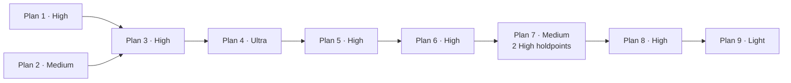

# Autonoom verbetertraject Software Factory

**Status:** alle negen plannen en alle 25 werkpakketten afgerond; zie `VOORTGANG.md` voor het actuele bewijs<br>
**Peildatum bronanalyse:** 11 juli 2026<br>
**Voorbereidingsstory:** `SF-925`<br>
**Voorbereidings-PR:** `#74` (`verbeterpunten` → `main`)<br>
**Bronplan:** [`../verbeterplan-onderhoudbaarheid-2026-07.md`](../verbeterplan-onderhoudbaarheid-2026-07.md)

Deze map splitst het grote onderhoudbaarheidsplan in zelfstandige opdrachten. Iedere opdracht kan
in een nieuw Codex-gesprek worden uitgevoerd zonder context uit het gesprek waarin de audit is
gemaakt. De plannen zijn bewust op complexiteit gegroepeerd, zodat per gesprek één passend
GPT-5.6-Sol-effortniveau gekozen kan worden.

De statusregel in ieder deelplan beschrijft de uitgangstoestand. Alleen
[`VOORTGANG.md`](VOORTGANG.md) is de live statusbron; leid actuele voortgang nooit af uit een oud
planheader of chatbericht.

De plannen veranderen de inhoudelijke audit niet. Het bronplan blijft leidend voor de bevinding en
het vereiste eindresultaat. De deelplannen zijn bindend voor storyscope, temporisering,
dependencyvolgorde, uitvoermodel, voortgang en overdracht. Een broncriterium mag daardoor naar een
later deelplan worden verplaatst, maar nooit verdwijnen of worden afgezwakt. De expliciete mapping
hieronder beslist bij een schijnbaar verschil; ontbreekt een mapping, registreer dan een blokkade in
plaats van zelf een criterium te laten vallen.

## Documenten

| Document | Functie |
| --- | --- |
| [`UITVOERREGELS.md`](UITVOERREGELS.md) | Verplichte story-, branch-, review-, test- en overdrachtsregels |
| [`VOORTGANG.md`](VOORTGANG.md) | Actuele status, storykeys, branches, PR's, testbewijs en blokkades |
| [`baselines/quality-cc7cac2.json`](baselines/quality-cc7cac2.json) | Machineleesbare qualitynulmeting vóór plan 01 op auditcommit `cc7cac2` |
| [`01-merge-en-testinvariant-high.md`](01-merge-en-testinvariant-high.md) | Centrale mergepolicy en machine-verifieerbaar testbewijs |
| [`02-directe-reparaties-medium.md`](02-directe-reparaties-medium.md) | Afgebakende actuele fouten en veilige workspace-cleanup |
| [`03-ci-documentatie-en-moduleborging-high.md`](03-ci-documentatie-en-moduleborging-high.md) | Volledige CI, documentatiedrift en module-API-conventie |
| [`04-duurzame-agent-completion-ultra.md`](04-duurzame-agent-completion-ultra.md) | Idempotente, hervatbare agent-completion |
| [`05-application-en-domeinrefactors-high.md`](05-application-en-domeinrefactors-high.md) | Dashboard-, command-, pipeline- en trackergrenzen |
| [`06-platform-ai-en-frontendrefactors-high.md`](06-platform-ai-en-frontendrefactors-high.md) | Contracts, configuratie/I/O, AI-suppliers en Flutter |
| [`07-modulemigraties-medium.md`](07-modulemigraties-medium.md) | Telegram en overige Modulith-roots mechanisch migreren |
| [`08-architectuur-en-kwaliteitsgates-high.md`](08-architectuur-en-kwaliteitsgates-high.md) | Quality regression gate en expliciete moduleafhankelijkheden |
| [`09-cleanup-en-eindverificatie-light.md`](09-cleanup-en-eindverificatie-light.md) | Naamcleanup, dode code en trajectbrede eindcontrole |

## Bindende backlogmapping bij temporisering

| Broncriterium | Bindende uitvoering in dit traject |
| --- | --- |
| `MOD-02` noemt direct `allowedDependencies` bij de Telegrammigratie | Plan 07 maakt alleen publieke grenzen en internals conform. Plan 08 / `ARC-08` legt daarna voor **alle** definitieve modules tegelijk de gemotiveerde dependencyrichtingen en `allowedDependencies` vast. |
| `web` en `bridge` worden inhoudelijk door `ARC-01` ontkoppeld | Plan 07 voert als laatste modulewerk uitsluitend de mechanische conventie-/allowlistnacontrole uit; nieuw dashboard- of bridgeontwerp is daar verboden. |
| `ProjectRepoResolver` evolueert naar afzonderlijke catalogusloading, validatie en getypeerde runtime-/deploymentsettings | Plan 06 / `ARC-07` voert deze inhoudelijke splitsing volledig uit en verwijdert de brede resolver zonder vervangende `ProjectCatalog`-godfacade. Plan 09 controleert dit alleen en ruimt hooguit achtergebleven naam-/documentatiereferenties mechanisch op; ontbreekt de split, dan gaat de blokkade terug naar `ARC-07`. |
| Quality wordt pas in `QLT-01` een verplichte regressiegate | De oorspronkelijke trajectnulmeting staat al vóór plan 01 vast in `baselines/quality-cc7cac2.json`; `QLT-01` bouwt daar later de repositorybrede ratchet en CI-gate omheen. |

## Drie verschillende grensregistraties

Gebruik het woord *allowlist* niet voor drie verschillende mechanismen:

- de **`MOD-01`-migratieallowlist** bevat tijdelijke bestaande moduleovertredingen, mag alleen
  krimpen en moet vóór plan 08 volledig leeg zijn;
- het **`ARC-07` composition-root-boundaryregister** noemt exact welke composition roots directe
  procesomgeving/platformtoegang mogen hebben. Dit is permanent architectuurbeleid, geen
  overtredingsallowlist, en mag alleen door een expliciet architectuurbesluit krimpen;
- de **quality-suppressiebaseline** start op auditcommit `cc7cac2` met exact één bekende
  productiesuppressie (`BridgeRequestHandler.kt`, `@Suppress("unused")`). De versioned telling mag
  alleen naar nul dalen en nooit groeien; QLT-01 verwijdert haar alleen wanneer dat veilig kan.

De actuele aantallen, versies, paden en delta's horen in de vaste storyoverdracht van
[`VOORTGANG.md`](VOORTGANG.md).

## Oorspronkelijke qualitynulmeting

[`baselines/quality-cc7cac2.json`](baselines/quality-cc7cac2.json) is de onveranderlijke nulmeting
voor het hele traject: score 354, 353 Detekt-findings en één productiesuppressie op auditcommit
`cc7cac2`. De hotspotwaarden uit dat bestand worden vóór plan 01 in de voor/na-matrix van
`VOORTGANG.md` vastgezet. Iedere eigenaarstory vult haar actuele na-meting in; plan 09 vergelijkt de
gemergede eind-SHA met deze oorspronkelijke waarden. Een rename of move geldt niet als verbetering
wanneer dezelfde finding inhoudelijk blijft bestaan.

## Verplichte uitvoervolgorde



Plan 1 en plan 2 mogen na het mergen van deze plandocumentatie na elkaar of in strikt gescheiden
worktrees parallel worden uitgevoerd. Begin plan 3 pas wanneer beide volledig zijn gemerged en
groen. Voer plan 3 tot en met plan 9 standaard sequentieel uit. Dat voorkomt dat mechanische
packageverplaatsingen tegelijk plaatsvinden met inhoudelijke refactors van dezelfde modules.

## Model- en effortkeuze

| Plan | Aanbevolen instelling | Reden |
| --- | --- | --- |
| 1 | GPT-5.6 Sol · High | Mergebeleid en testbewijs zijn repositorybrede veiligheidsinvarianten |
| 2 | GPT-5.6 Sol · Medium | De fouten zijn concreet, reproduceerbaar en afgebakend |
| 3 | GPT-5.6 Sol · High | CI-, documentatie- en architectuurgates bepalen blijvend beleid |
| 4 | GPT-5.6 Sol · Ultra | Failure recovery, idempotency en precies-één-keer-effecten vragen de diepste analyse |
| 5 | GPT-5.6 Sol · High | Grote application- en domeingrenzen, met bestaand gedrag als harde randvoorwaarde |
| 6 | GPT-5.6 Sol · High | Maven-, contract-, supplier-, I/O- en frontendgrenzen raken meerdere runtimes |
| 7 | GPT-5.6 Sol · Medium per mechanische modulestory; GPT-5.6 Sol · High voor Telegram-API-design en core-contractclassificatie | Packagewerk blijft mechanisch; de twee resterende contractkeuzes krijgen ieder een afzonderlijke Codex-taak en reviewholdpoint vóór implementatie |
| 8 | GPT-5.6 Sol · High | De definitieve dependency- en qualitygates moeten zonder schijnzekerheid worden ontworpen |
| 9 | GPT-5.6 Sol · Light | Alleen mechanische cleanup en het uitvoeren/controleren van bestaande gates |

Een uitvoerende agent mag een hoger niveau adviseren wanneer de actuele code wezenlijk complexer
blijkt dan de vastgelegde uitgangssituatie. Een plan wordt dan niet half op het lagere niveau
afgemaakt: leg de reden vast in `VOORTGANG.md` en hervat het plan in een nieuw gesprek op het hogere
niveau. Verlaag het niveau niet binnen een al gestarte planopdracht.

## Zo start je een plan buiten dit gesprek

1. Controleer dat de onveranderlijke qualitynulmeting voor `cc7cac2` bestaat, hash/commit klopt en
   de hotspotmatrix in [`VOORTGANG.md`](VOORTGANG.md) is ingevuld. Plan 01 start anders niet.
2. Controleer in [`VOORTGANG.md`](VOORTGANG.md) dat alle prerequisites `AFGEROND` zijn.
3. Werk de lokale repository bij naar de actuele, groene default branch en controleer dat de
   worktree geen onbekende wijzigingen bevat.
4. Kies in Codex het model en effortniveau uit bovenstaande tabel. Start voor de twee plan-07-
   designholdpoints nadrukkelijk een nieuwe High-taak en hervat de mechanische story daarna in een
   nieuwe Medium-taak op de gereviewde commit.
5. Start een nieuw gesprek in deze repository met onderstaande opdracht, waarbij je het plannummer
   en bestand vervangt.

```text
Voer plan 01 volledig autonoom uit volgens
docs/verbetertraject-2026-07/01-merge-en-testinvariant-high.md.

Lees vóór iedere wijziging ook:
- docs/verbetertraject-2026-07/UITVOERREGELS.md
- docs/verbetertraject-2026-07/VOORTGANG.md
- docs/verbeterplan-onderhoudbaarheid-2026-07.md

Maak voor ieder werkpakket een Factory-story. Werk story voor story met een eigen branch en PR,
laat developer, reviewer en tester hun volledige gates uitvoeren, negeer geen enkele falende test,
werk de voortgang na iedere story bij en ga autonoom door tot het hele plan aantoonbaar afgerond is.
Push en merge alleen na alle vereiste groene checks. Stop uitsluitend bij een echte externe
blokkade of een onomkeerbare productbeslissing die niet uit de documentatie is af te leiden.
```

## Wanneer is een plan afgerond?

Een plan krijgt pas status `AFGEROND` als:

- ieder opgenomen werkpakket een eigen Factory-story en traceerbare PR/commit heeft;
- alle wijzigingen op de bedoelde default branch zijn gemerged;
- de volledige tests uit het plan op de gemergede toestand groen zijn;
- geen unit-, integratie-, e2e-, Flutter- of smoketest als “pre-existing” is genegeerd;
- reviewer en tester expliciet akkoord zijn op basis van vers groen bewijs;
- code, actuele documentatie en eventuele migraties onderling overeenkomen;
- `VOORTGANG.md` voor iedere story de vaste overdrachtsvelden bevat, inclusief baseline-/eind-SHA,
  PR, gates, approval-SHA's, artifacts, besluiten, open items en volgende startgate;
- de overdrachtscontrole voor het volgende plan groen is.

## Bronnen van waarheid

- **Actief werk:** de Factory-story plus de gepushte storybranch/PR.
- **Afgerond werk:** de gemergede code en [`VOORTGANG.md`](VOORTGANG.md).
- **Auditbevindingen en vereist eindresultaat:** het
  [`bronplan`](../verbeterplan-onderhoudbaarheid-2026-07.md).
- **Storyscope en temporisering van broncriteria:** het betreffende deelplan en de bindende
  backlogmapping in dit document.
- **Procesinvarianten:** [`UITVOERREGELS.md`](UITVOERREGELS.md).

Een chatbericht, lokale niet-gepushte wijziging of alleen een groen gerichte test geldt nooit als
duurzaam voortgangsbewijs.
